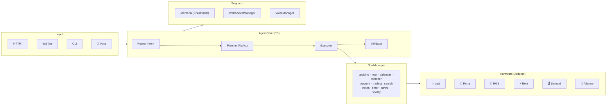

# M.A.Y.A. — Multitask Advanced Yielding Assistant


**Sistema domotico intelligente per una casa fisica interattiva**, con dashboard dinamica e controllo centralizzato dei dispositivi.  
Costruito su **Ollama** + **FastAPI** con architettura agentica **Planner → Executor → Validator**, pensato per l'**Arduino Day 2026**.

> *Elaborato da Gabriele Rossoni e Marcello Patrini — 4IB, ITIS di Crema*

---

## Idea Centrale

M.A.Y.A. non è un chatbot generico: è il **cervello unico che orchestra la casa**.  
Una casa intelligente in miniatura dove il PC fa i calcoli pesanti e Arduino gestisce il mondo fisico — luci, porte, sensori, ventilazione, allarmi.

La differenza rispetto ai sistemi già esistenti:

- **Controllo locale e privacy** — il cuore del sistema funziona offline, senza cloud
- **Gestione multi-stanza e multi-scenario** — non un singolo dispositivo acceso/spento, ma un ambiente coordinato
- **Interfaccia dinamica** — la dashboard mostra la casa come un sistema vivo, non come un menu statico
- **Linguaggio naturale in italiano** — comandi normali, senza formule rigide
- **Scene e routine** — modalità studio, notte, relax, uscita, ospiti

---

## Architettura



**Divisione dei ruoli:**

| | PC | Arduino |
|---|---|---|
| **Ruolo** | Unità intelligente | Unità fisica |
| **Fa** | Interpreta comandi, gestisce logica, LLM | Accende, muove, legge, risponde |
| **Comunicazione** | Seriale USB (JSON) | Seriale USB (JSON) |

---

## Elementi Domotici

### MVP (minimo per la demo)

| Elemento | Hardware | Comandi |
|---|---|---|
| **Luci principali** | LED + Relè | `LIGHT_ON`, `LIGHT_OFF`, `LIGHT_PWM` (dimmer) |
| **Porta/accesso** | Servo motore | `SERVO_OPEN`, `SERVO_CLOSE` |
| **Scena ambiente** | LED RGB / NeoPixel | Colori e scene configurabili |

### Obiettivo Esteso

| Elemento | Hardware | Scopo |
|---|---|---|
| **Tapparella/tendina** | Secondo servo o stepper | Simula presenza e routine |
| **Ventilazione** | Ventola + relè | Comfort e clima |
| **Allarme** | Buzzer | Segnale stato anomalo |
| **Sensore contesto** | DHT11/DHT22, PIR | Temperatura, movimento, contesto credibile |

---

## Scene e Automazioni

Il sistema gestisce la casa come un **ambiente che cambia stato**, non come una lista di device.

| Scena | Cosa succede |
|---|---|
| `buonanotte` | Luci off, RGB spento, porta chiusa |
| `modalità lavoro` | Luci accese, apri browser, notifica secondo PC |
| `modalità film` | Relè on, luci off, browser aperto |
| `modalità studio` | Luce concentrazione, RGB warm, ventola off |
| `modalità relax` | Luci dim, RGB viola, ambiente soft |
| `modalità uscita` | Tutto off, porta chiusa, allarme attivo |

Le scene sono attivabili via:
- **Linguaggio naturale**: *"Maya, buonanotte"*
- **Dashboard**: bottoni rapidi
- **Voce**: *"Ehi Maya, modalità studio"*

---

## Caratteristiche

- **Agentic ReAct Loop** — ciclo di ragionamento asincrono (Ragiona → Agisci → Osserva) con routing intelligente dell'intent
- **Voice I/O Integrato** — STT via `faster-whisper` (tiny) e TTS via `Piper` (modello Paola) con VAD adattivo e calibrazione rumore ambientale
- **Memoria Semantica Vettoriale** — database vettoriale **ChromaDB** per recupero contesto a lungo termine e sliding window per coerenza immediata
- **Monitoraggio Proattivo** — checker in background per CPU/RAM alta ed eventi calendario imminenti, broadcast via WebSocket
- **Dashboard HUD Dinamica** — schermata idle con orologio e particelle, schermata work con orb 3D Three.js, pannelli live per Meteo, Notizie, Trading, Stato Casa, Calendario, Spotify
- **Comandi in Italiano** — linguaggio naturale, senza formule rigide
- **Graceful Degradation** — senza Arduino il sistema degrada in simulazione automatica, senza Ollama fallback a Groq o parser keyword

---

## Stack Tecnologico

| Livello | Tecnologia |
|---|---|
| Modelli LLM | Ollama (llama3.2, phi4, mistral-small) |
| Fallback LLM | Groq API (llama-3.3-70b-versatile) |
| API Backend | FastAPI + Uvicorn |
| Tempo reale | WebSockets (nativo FastAPI) |
| Hardware | PySerial + Arduino (C++) |
| Rete | Socket TCP raw (secondo PC) |
| Finanza | CoinGecko API + yfinance |
| Meteo | Open-Meteo API (geocoding + forecast) |
| Notizie | feedparser (RSS ANSA) |
| Ricerca | DuckDuckGo Search |
| Traduzione | deep-translator (Google backend) |
| Monitoraggio | psutil |
| Media | keyboard (tasti multimediali) + Spotify API |
| Interfaccia | Three.js (orb 3D) + Leaflet.js (mappe) + TradingView Widget |
| Persistenza | ChromaDB (vettoriale) + JSON locale |
| Voce | Faster-Whisper (STT) + Piper TTS |
| Multi-stanza | MQTT (paho-mqtt) |
| Desktop | Electron (wrapper opzionale) |

---

## Struttura Repository

```
maya/
├── main.py                    # Entrypoint: FastAPI, lifecycle, CLI, WS, broadcaster
├── instance_guard.py          # Lock single-instance
├── MAYA_DESKTOP.bat           # Launcher rapido Windows
│
├── core/
│   ├── agent_core.py          # Planner/Executor/Validator, LLM routing, automazioni
│   ├── tool_manager.py        # Registry e dispatcher di tutti i tool
│   ├── memory_manager.py      # Memoria semantica ChromaDB + sliding window
│   ├── voice_manager.py       # Voice I/O: Whisper STT + Piper TTS + VAD
│   ├── websocket_manager.py   # Broadcast manager WebSocket
│   ├── plugin_loader.py       # Caricamento dinamico plugin
│   ├── proactive_manager.py   # Monitor proattivo CPU/RAM/calendario
│   └── log_utils.py           # Filtro log per dashboard
│
├── tools/
│   ├── arduino_tool.py        # Seriale USB → Arduino (auto-discovery + sim mode)
│   ├── mqtt_tool.py           # Controllo multi-room via MQTT
│   ├── network_tool.py        # TCP client + server (secondo PC)
│   ├── system_tool.py         # Comandi OS (shutdown, browser, screenshot, volume)
│   ├── calendar_tool.py       # Calendario locale JSON
│   ├── weather_tool.py        # Open-Meteo geocoding + forecast
│   ├── news_tool.py           # RSS reader (ANSA)
│   ├── wikipedia_tool.py      # Wikipedia summary (IT)
│   ├── notes_tool.py          # Todo list e appunti JSON
│   ├── trading_tool.py        # CoinGecko + yfinance + TradingView
│   ├── timer_tool.py          # Timer asincrono
│   ├── translate_tool.py      # deep-translator
│   ├── search_tool.py         # DuckDuckGo web search
│   ├── spotify_tool.py        # Spotify API + media keys
│   ├── sys_monitor_tool.py    # CPU % + RAM % via psutil
│   ├── display_tool.py        # ASCII status panel (terminale)
│   └── code_generator_tool.py # Generazione tool a runtime
│
├── arduino/
│   └── jarvis_controller.ino  # Firmware Arduino: LED, relay, servo, serial protocol
│
├── static/
│   ├── jarvis_dashboard.html  # SPA dashboard HUD — slider, Three.js orb, pannelli live
│   ├── sfondo-maya.png        # Background work-mode
│   ├── maya_logo.png          # Logo MAYA
│   └── maya_logo_no_sfondo.png
│
├── electron/
│   ├── main.js                # Electron wrapper (fullscreen, shortcuts)
│   └── preload.js
│
├── voice/
│   ├── piper.exe              # TTS engine
│   ├── it_IT-paola-medium.onnx # Modello voce italiana
│   └── hey_maya.onnx          # Wake word model
│
├── data/                      # Runtime data (gitignored)
│   ├── chroma_db/             # Vector database
│   ├── memory_metadata.json
│   ├── calendar.json
│   └── notes.json
│
├── tests/                     # Test suite
├── plugins/                   # Plugin dinamici (hot-reload)
├── requirements.txt
├── .env.example
└── .gitignore
```

---

## Installazione e Avvio

### 1. Prerequisiti

- Python 3.10+
- [Ollama](https://ollama.com/) installato e in esecuzione
- Arduino (opzionale — il sistema degrada in simulazione automaticamente)

### 2. Installazione

```bash
git clone https://github.com/gabrielerossoni/maya-ai-assistant.git
cd maya-ai-assistant
pip install -r requirements.txt
```

### 3. Configurazione

```bash
cp .env.example .env
# Edita .env con i tuoi parametri
```

Variabili principali:

```env
# LLM
OLLAMA_HOST=127.0.0.1
MODEL_CHITCHAT=llama3.2       # chiacchiere
MODEL_DOMOTIC=phi4             # domotica e tool
MODEL_REASONING=mistral-small  # ragionamento complesso
MODEL_ROUTER=llama3.2:1b       # classificazione intent

# Hardware
ARDUINO_PORT=AUTO              # oppure COM3, /dev/ttyUSB0
ARDUINO_BAUD_RATE=9600

# Rete secondo PC
REMOTE_HOST=192.168.1.100
REMOTE_PORT=9999

# Tool defaults
DEFAULT_WEATHER_LOCATION=Crema
NEWS_FEED_URL=https://www.ansa.it/sito/ansait_rss.xml

# Groq (fallback cloud, opzionale)
GROQ_API_KEY=
GROQ_MODEL=llama-3.3-70b-versatile
```

### 4. Download modelli Ollama

```bash
ollama pull llama3.2
ollama pull llama3.2:1b
ollama pull phi4
ollama pull mistral-small
ollama pull nomic-embed-text   # per memoria semantica
```

### 5. Avvio

```bash
python main.py
```

La dashboard si apre automaticamente su `http://127.0.0.1:8000`

---

## Protocollo Arduino

### Comunicazione Seriale

Baud: `9600` | Formato: comandi stringa con terminatore `\n`

| Comando | Effetto | Risposta |
|---|---|---|
| `LIGHT_ON` | LED pin 13 HIGH | `OK:LIGHT_ON` |
| `LIGHT_OFF` | LED pin 13 LOW | `OK:LIGHT_OFF` |
| `RELAY_ON` | Relay pin 7 HIGH | `OK:RELAY_ON` |
| `RELAY_OFF` | Relay pin 7 LOW | `OK:RELAY_OFF` |
| `SERVO_OPEN` | Servo → 90° | `OK:SERVO_OPEN` |
| `SERVO_CLOSE` | Servo → 0° | `OK:SERVO_CLOSE` |
| `STATUS` | Report stato | `STATUS:LIGHT=ON,RELAY=OFF,SERVO=0` |

Senza Arduino connesso, il sistema entra in **modalità simulazione** — nessuna modifica al codice necessaria.

### Schema Hardware

```
Arduino Uno/Nano
├── Pin 13 → LED (luce principale)
├── Pin  7 → Relè (attuatore generico)
├── Pin  9 → Servo (porta/accesso)
└── USB    → Seriale verso PC
```

---

## WebSocket API

Il frontend si connette a `ws://127.0.0.1:8000/ws`.

### Messaggi server → client

```json
{ "type": "log",     "text": "...", "level": "ok|info|warn" }
{ "type": "stream",  "token": "...", "full_text": "..." }
{ "type": "stats",   "neural_load": 12.4, "memory": 45.2 }
{ "type": "state",   "led": "on", "relay": "off", "servo": "closed", "models": {...} }
{ "type": "weather", "data": {...} }
{ "type": "trading", "symbol": "BTC", "price": 68000, "change_pct": 2.4 }
{ "type": "news",    "articles": [...] }
{ "type": "calendar_data", "events": [...] }
{ "type": "spotify", "track": "...", "artist": "...", "is_playing": true }
{ "type": "voice_status", "status": "listening|speaking|idle" }
{ "type": "layout",  "layout": "orb|weather|news|dashboard", "params": {...} }
```

### Messaggi client → server

```json
{ "type": "command", "text": "accendi la luce" }
{ "type": "tool", "action": { "tool": "trading", "operation": "overview" } }
{ "type": "tool", "action": { "tool": "calendar", "operation": "list" } }
```

---

## Aggiungere un Tool

1. Creare `tools/my_tool.py` con classe `MyTool` che implementa `initialize()` e `execute()`
2. Registrarlo in `core/tool_manager.py`:
   ```python
   from tools.my_tool import MyTool
   # in initialize():
   "my_tool": MyTool(),
   ```
3. Aggiungerlo al `SYSTEM_PROMPT` in `core/agent_core.py` nella sezione "Tool disponibili"

### Interfaccia Tool

```python
class MyTool:
    def initialize(self) -> None: ...
    def execute(self, action: dict) -> dict: ...
    # Per tool asincroni:
    async def execute(self, action: dict) -> dict: ...
```

Contratto di risposta:

```json
{ "status": "ok" | "error" | "warning", "message": "..." }
```

---

## Formato JSON LLM

Il sistema prompt forza l'LLM a rispondere in questo schema:

```json
{
  "intent": "descrizione breve del task",
  "layout": "orb | weather | map | browser | news | dashboard",
  "layout_params": {},
  "actions": [
    { "tool": "weather", "location": "Crema" },
    { "tool": "arduino", "command": "LIGHT_ON" }
  ],
  "reply": "Risposta naturale in italiano"
}
```

In caso di fallback (Ollama non disponibile), `_fallback_parse()` gestisce le keyword più comuni senza LLM.

---

## Note Tecniche

- Il **routing dell'intent** utilizza una logica ibrida: instradamento diretto per task comuni e router LLM per quelli complessi, ottimizzando i tempi di risposta
- Il **ReAct Loop** è ottimizzato per evitare il "doppio routing": l'intent viene determinato una sola volta fuori dal ciclo
- **Uscita anticipata**: se il tool produce un risultato soddisfacente al primo step, il sistema non fa riformulazione superflua
- `VoiceManager` include una fase di calibrazione VAD automatica per adattarsi al rumore ambientale
- `ChromaDB` garantisce che l'agente ricordi fatti avvenuti giorni o settimane prima
- Catena di fallback: **Groq (cloud) → Ollama (locale) → Parser a keyword (offline)**

---

## Milestone di Progetto

| Data | Verifica | Obiettivo |
|---|---|---|
| 16/05/2026 | Verifica 1 | Schema scelto, prime prove hardware, dashboard aperta, almeno un dispositivo che risponde |
| 23/05/2026 | Verifica 2 | Flusso completo comando → elaborazione → Arduino → feedback |
| 30/05/2026 | Verifica 3 | Demo stabile, correzione errori, prova con pubblico interno, video di backup pronto |
| 04/06/2026 | Arduino Day | Solo rifinitura e presentazione. Niente nuove funzioni |

---

## Roadmap

### Completati
- [x] Architettura agentica ReAct con routing ibrido
- [x] Voce bidirezionale (Whisper locale + Piper TTS)
- [x] Memoria semantica (ChromaDB + embedding Ollama)
- [x] Monitoraggio proattivo (CPU/RAM/calendario)
- [x] Dashboard HUD bimodale con orb 3D e slider animato
- [x] Panoramica trading live senza API key
- [x] Meteo HUD con mappa Leaflet e previsioni
- [x] Notizie HUD con articolo in evidenza + ticker
- [x] Comunicazione seriale Arduino con auto-discovery e simulazione
- [x] Multi-modello LLM con catena di fallback (Groq → Ollama → Parser)
- [x] Wrapper desktop Electron

### In corso
- [ ] Allineamento protocollo firmware Arduino ↔ Python
- [ ] Espansione elementi domotici (RGB, tapparella, ventola, allarme, sensori)
- [ ] Scene e routine aggiuntive (notte, studio, uscita, ospite)
- [ ] Pannello "stato casa" nella dashboard con comandi rapidi

### Futuro
- [ ] Google Calendar sync (OAuth2)
- [ ] Streaming LLM token-by-token via WebSocket
- [ ] Plugin system dinamico (hot-reload senza restart)
- [ ] Multi-room Arduino con broker MQTT
- [ ] Dashboard mobile (PWA)
- [ ] Notifiche visive su cambio stato casa
- [ ] Memoria preferenze utente persistente

---

## .gitignore — Cosa viene escluso

```
data/          # chroma_db, memory_metadata, calendar, notes
.env           # credenziali e configurazioni locali
.venv/         # virtualenv
__pycache__/
node_modules/
.vscode/
.windsurf/
logs/
scratch/
.dist/
```

---

## Autori

Progetto sviluppato da studenti dell'**ITIS di Crema** per l'**Arduino Day 2026**.

| | |
|---|---|
| **Gabriele Rossoni** — *Project Manager & Lead Developer* | Ideazione, architettura e sviluppo principale del sistema. |
| **Marcello Patrini** — *Co-Developer* | Contributi allo sviluppo e testing. |

[](https://github.com/gabrielerossoni)

---

<p align="center">
  <strong>M.A.Y.A.</strong> — Un cervello per la casa, non l'ennesimo chatbot.<br>
  <em>ITIS di Crema • Arduino Day 2026</em>
</p>