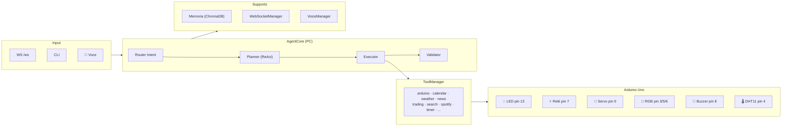

# M.A.Y.A. — Multitask Advanced Yielding Assistant


**Sistema domotico intelligente per una casa fisica interattiva**, con dashboard HUD dinamica e controllo centralizzato di luci, servo, RGB, buzzer e sensori.  
Costruito su **Ollama** + **FastAPI** con architettura agentica **Planner → Executor → Validator**, pensato per l'**Arduino Day 2026**.

> **Ultimo aggiornamento:** Maggio 2026 — Google Calendar OAuth2, MQTT multi-room, dashboard calendario HUD, Electron desktop con icona MAYA, bug fixes pre-demo.

> *Elaborato da Gabriele Rossoni e Marcello Patrini — 4IB, ITIS di Crema*

---

## Idea Centrale

M.A.Y.A. non è un chatbot generico: è il **cervello unico che orchestra la casa**.  
Una casa intelligente in miniatura dove il PC fa i calcoli pesanti e Arduino gestisce il mondo fisico — luci, porte, sensori, RGB, buzzer.

La differenza rispetto ai sistemi già esistenti:

- **Controllo locale e privacy** — il cuore del sistema funziona offline, senza cloud
- **Gestione multi-scenario** — non un singolo dispositivo acceso/spento, ma un ambiente coordinato
- **Dashboard HUD dinamica** — pannello "STATO CASA // LIVE" con stato real-time di ogni dispositivo
- **Linguaggio naturale in italiano** — comandi normali, senza formule rigide
- **18 scene configurate** — modalità studio, notte, film, relax, uscita, ospite, allarme + scene giornaliere (buongiorno, cena, sveglia, piove, pausa caffè e altre)

---

## Architettura



**Divisione dei ruoli:**

| | PC | Arduino |
|---|---|---|
| **Ruolo** | Unità intelligente | Unità fisica |
| **Fa** | Interpreta comandi, gestisce logica, LLM | Accende, muove, legge, risponde |
| **Comunicazione** | Seriale USB (JSON 115200 baud) | Seriale USB (JSON 115200 baud) |

---

## Hardware & Pin Mapping

### Schema di collegamento

```
Arduino Uno / Nano
├── Pin 13  →  LED             (luce principale — digitale)
├── Pin  7  →  Relè            (attuatore generico — digitale)
├── Pin  9  →  Servo SG90      (porta / accesso — PWM)
├── Pin  5  →  RGB canale R    (PWM analogWrite)
├── Pin  6  →  RGB canale G    (PWM analogWrite)
├── Pin  3  →  RGB canale B    (PWM analogWrite)
├── Pin  8  →  Buzzer          (allarme — digitale, auto-off 200 ms)
├── Pin  4  →  DHT11           (temperatura e umidità — OneWire)
└── USB     →  Seriale PC      (115200 baud)
```

### Tabella componenti

| Dispositivo | Pin | Tipo segnale | Note |
|---|---|---|---|
| LED (luce principale) | 13 | Digitale OUT | HIGH = acceso |
| Relè | 7 | Digitale OUT | HIGH = attivato |
| Servo SG90 (porta) | 9 | PWM / Servo | 0° = chiusa, 90° = aperta |
| RGB — canale R | 5 | PWM (analogWrite) | 0–255 |
| RGB — canale G | 6 | PWM (analogWrite) | 0–255 |
| RGB — canale B | 3 | PWM (analogWrite) | 0–255 |
| Buzzer | 8 | Digitale OUT | Cicalino, auto-off dopo 200 ms |
| DHT11 | 4 | OneWire | Temp. + umidità; telemetria ogni 5 s |

### Dipendenze firmware

```
ArduinoJson  6.x   (parsing JSON)
Servo.h             (libreria built-in)
DHT.h               (Adafruit DHT sensor library)
```

---

## Protocollo Arduino

Comunicazione seriale **115200 baud**, una riga JSON per messaggio, terminata con `\n`.

### Richiesta (PC → Arduino)

```json
{"id": 1, "cmd": "SET", "target": "light", "value": 1}
```

| Campo | Valori |
|---|---|
| `cmd` | `"SET"` oppure `"GET"` |
| `target` | `"light"` · `"relay"` · `"servo"` · `"rgb"` · `"buzzer"` · `"sensor_read"` |
| `value` | `0`/`1` per digitali · `0–180` per servo · intero `0xRRGGBB` o oggetto `{"r":R,"g":G,"b":B}` per RGB |

### Risposta (Arduino → PC)

```json
{
  "id": 1,
  "status": "ok",
  "state": {
    "light": true,
    "relay": false,
    "servo": 90,
    "rgb": [255, 238, 153],
    "buzzer": false
  }
}
```

### Telemetria (non richiesta, ogni 5 s)

```json
{"telemetry": {"temp": 22.4, "humidity": 58.1, "uptime_ms": 12000}}
```

### Risposta errore

```json
{"id": -1, "status": "error", "msg": "parse_fail"}
```

Senza Arduino connesso il sistema entra automaticamente in **modalità simulazione** — nessuna modifica al codice necessaria.

---

## Scene e Automazioni

Le scene sono attivabili via linguaggio naturale (*"Maya, modalità studio"*), pulsanti dashboard o voce.

**Scene ambiente:**

| Scena | Luci | Relay | Servo | RGB | Buzzer | Altro |
|---|---|---|---|---|---|---|
| `modalità notte` | ❌ | ❌ | 0° | `#000022` blu scuro | — | Spotify pause |
| `modalità studio` | ✅ | ❌ | — | `#FFEE99` caldo | — | — |
| `modalità film` | ❌ | ✅ | — | `#220000` rosso tenue | — | — |
| `modalità relax` | ❌ | ✅ | — | `#440055` viola | — | — |
| `modalità uscita` | ❌ | ❌ | 0° | spento | ✅ 1 bip | — |
| `modalità ospite` | ✅ | ✅ | 90° | `#FFFFFF` bianco | — | — |
| `allarme` | — | — | — | `#FF0000` rosso | ✅ | — |

**Scene giornaliere:**

| Scena | Azione principale | Extra |
|---|---|---|
| `buongiorno` | Luce + RGB alba `#FFD580` | Meteo, notizie, calendario, Spotify mattina |
| `sveglia` | Buzzer + luce piena + RGB bianco | Spotify energetico |
| `cena` | RGB arancio `#FF4400`, tutto soffuso | Spotify cena romantica |
| `ospiti in arrivo` | Luce + porta aperta 90° + RGB caldo | Spotify house party |
| `vado fuori` | Tutto spento, porta chiusa, bip | Spotify pause, meteo |
| `sono rientrato` | Luce + porta 90° + RGB `#FF8C42` | Timer 5min chiudi porta, notizie |
| `ora di dormire` | Tutto spento, RGB blu `#000008` | Spotify pause, calendario domani |
| `piove` | Porta chiusa, luce + RGB blu `#4488FF` | Spotify lofi, meteo |
| `pausa caffè` | Relay ON (macchinetta) + RGB marrone | Spotify jazz, timer 3min, notizie |
| `bambini dormono` | Tutto spento silenzioso | Spotify pause |
| `weekend mattina` | RGB ambra `#FFCC88` soffusa | Spotify lazy, meteo, notizie |

---

## Caratteristiche

- **Agentic ReAct Loop** — ciclo asincrono Ragiona → Agisci → Osserva con routing ibrido dell'intent
- **Voice I/O Integrato** — STT via `faster-whisper` (tiny) e TTS via `Piper` (voce Paola) con VAD adattivo
- **Memoria Semantica Vettoriale** — ChromaDB per recupero contesto a lungo termine + sliding window
- **Dashboard HUD Dinamica** — idle con orologio e particelle; work con orb 3D Three.js; pannelli live per Meteo, Notizie, Trading, Stato Casa, Calendario (griglia mensile + prossimi eventi), Spotify
- **Google Calendar Sync** — OAuth2 con token locale; mostra solo il calendario selezionato via `GOOGLE_CALENDAR_ID` nel `.env`
- **Electron Desktop Wrapper** — finestra nativa senza browser, icona MAYA nella taskbar, F12 alwaysOnTop, Escape per reset layout
- **Stato Casa Live** — pannello "STATO CASA // LIVE" aggiornato in tempo reale: luci, relay, servo, RGB swatch, buzzer, temperatura, umidità
- **Telemetria Automatica** — DHT11 invia temperatura e umidità ogni 5 s; `sensor_broadcaster` pubblica ai client ogni 30 s
- **Graceful Degradation** — senza Arduino → simulazione automatica; `OLLAMA_ENABLED=false` → Groq cloud → parser keyword offline
- **Broadcast stato real-time** — ogni comando vocale/testuale aggiorna immediatamente i card della dashboard via WebSocket

---

## Stack Tecnologico

| Livello | Tecnologia |
|---|---|
| Modelli LLM | Ollama (llama3.2, phi4, mistral-small) |
| API Backend | FastAPI + Uvicorn |
| Tempo reale | WebSockets (nativo FastAPI) |
| Hardware | PySerial + Arduino Uno (C++) |
| Finanza | CoinGecko API + yfinance |
| Meteo | Open-Meteo API (geocoding + forecast) |
| Notizie | feedparser (RSS ANSA) |
| Ricerca | DuckDuckGo Search |
| Traduzione | deep-translator (Google backend) |
| Monitoraggio | psutil |
| Media | Spotify API (opzionale) |
| Interfaccia | Three.js (orb 3D) + Leaflet.js (mappe) + TradingView Widget |
| Persistenza | ChromaDB (vettoriale) + JSON locale |
| Voce | Faster-Whisper (STT) + Piper TTS |
| Multi-stanza | MQTT — paho-mqtt (opzionale) |

> **Opzionale:** Groq API (fallback cloud LLM), Electron (wrapper desktop — avvia con `MAYA_DESKTOP.bat`), Ngrok (tunnel remoto), Spotify API, Google Calendar API.

---

## Struttura Repository

```
maya/
├── main.py                    # Entrypoint: FastAPI, lifecycle, WS, broadcaster
├── MAYA_DESKTOP.bat           # Launcher rapido Windows (Electron)
├── package.json               # Electron / npm
│
├── core/
│   ├── agent_core.py          # Planner/Executor/Validator, routing, AUTOMATIONS
│   ├── tool_manager.py        # Registry e dispatcher di tutti i tool
│   ├── memory_manager.py      # Memoria semantica ChromaDB + sliding window
│   ├── voice_manager.py       # Voice I/O: Whisper STT + Piper TTS + VAD
│   ├── websocket_manager.py   # Broadcast manager WebSocket
│   ├── plugin_loader.py       # Caricamento dinamico plugin
│   ├── proactive_manager.py   # Monitor proattivo CPU/RAM/calendario
│   ├── instance_guard.py      # Lock single-instance
│   └── log_utils.py           # Filtro log per dashboard
│
├── tools/
│   ├── arduino_tool.py        # Seriale USB → Arduino (auto-discovery + sim mode)
│   ├── mqtt_tool.py           # Controllo multi-room via MQTT
│   ├── network_tool.py        # TCP client + server (secondo PC)
│   ├── system_tool.py         # Comandi OS (shutdown, browser, screenshot, volume)
│   ├── calendar_tool.py       # Calendario locale JSON + Google Calendar OAuth2
│   ├── weather_tool.py        # Open-Meteo geocoding + forecast
│   ├── news_tool.py           # RSS reader (ANSA)
│   ├── wikipedia_tool.py      # Wikipedia summary (IT)
│   ├── notes_tool.py          # Todo list e appunti JSON
│   ├── trading_tool.py        # CoinGecko + yfinance + TradingView
│   ├── timer_tool.py          # Timer asincrono
│   ├── translate_tool.py      # deep-translator
│   ├── search_tool.py         # DuckDuckGo web search
│   ├── spotify_tool.py        # Spotify API + media keys
│   ├── sys_monitor_tool.py    # CPU % + RAM % via psutil
│   ├── display_tool.py        # ASCII status panel (terminale)
│   └── code_generator_tool.py # Generazione tool a runtime
│
├── arduino/
│   └── maya_controller/
│       └── maya_controller.ino  # Firmware: LED, relay, servo, RGB, buzzer, DHT11
│
├── static/
│   ├── jarvis_dashboard.html  # SPA dashboard HUD — slider, Three.js orb, pannelli live
│   ├── sfondo-maya.png
│   ├── maya_logo.png
│   └── maya_logo_no_sfondo.png
│
├── voice/
│   ├── piper.exe              # TTS engine
│   ├── it_IT-paola-medium.onnx
│   └── hey_maya.onnx          # Wake word model
│
├── data/                      # Runtime data (gitignored)
│   ├── chroma_db/
│   ├── credentials.json       # Google OAuth2 (gitignored)
│   ├── token.json             # Google token (gitignored)
│   ├── memory_metadata.json
│   ├── calendar.json
│   └── notes.json
│
├── electron/
│   ├── main.js                # Electron main process
│   └── preload.js
│
├── tests/
├── plugins/
├── requirements.txt
├── .env.example
└── .gitignore
```

---

## Installazione e Avvio

### Prerequisiti

- Python **3.10+**
- [Ollama](https://ollama.com/) installato e avviato (`ollama serve`)
- Arduino Uno/Nano con firmware caricato *(opzionale — degrada in simulazione automaticamente)*

### 1. Clone e dipendenze

```bash
git clone https://github.com/gabrielerossoni/maya-ai-assistant.git
cd maya-ai-assistant
pip install -r requirements.txt
```

### 2. Configurazione

```bash
cp .env.example .env
```

Variabili **essenziali**:

```env
OLLAMA_ENABLED=true         # false per disabilitare Ollama (usa solo Groq/keyword fallback)
OLLAMA_HOST=127.0.0.1
ARDUINO_PORT=AUTO          # oppure COM3, COM4, /dev/ttyACM0, ecc.
ASSISTANT_NAME=MAYA
DEFAULT_WEATHER_LOCATION=Roma
NEWS_FEED_URL=https://www.ansa.it/sito/ansait_rss.xml
```

Variabili **opzionali**:

```env
SPOTIFY_ENABLED=false       # true solo se hai credenziali Spotify
GROQ_API_KEY=               # LLM cloud: primario se OLLAMA_ENABLED=false, altrimenti fallback
GROQ_MODEL=llama-3.3-70b-versatile
GROQ_ROUTER_MODEL=llama-3.1-8b-instant
```

### 3. Download modelli Ollama

```bash
ollama pull llama3.2
ollama pull phi4
ollama pull mistral-small
ollama pull nomic-embed-text   # per memoria semantica
```

### 4. Firmware Arduino — Classico o MQTT?

**Versione Classica (Seriale):**
- Un solo Arduino su cavo USB
- Comunicazione 115200 baud JSON
- ✅ Semplice, niente dipendenze esterne
- ❌ Distanza limitata, una sola stanza

**Versione MQTT (WiFi) — CONSIGLIATA:**
- Arduino R4 WiFi con WiFi integrato
- Comunicazione via MQTT Broker
- ✅ Multi-room, scalabile, wireless
- ⚠️ Richiede WiFi e Mosquitto locale
- **Consigliato per casa intelligente**, fallback a seriale sempre disponibile

**Come scegliere?**

```
Ho un Arduino Uno classico?        → Usa versione Seriale (original)
Ho un Arduino Uno R4 WiFi?         → Usa versione MQTT (nuovo firmware)
Voglio entrambi disponibili?       → Usa MQTT, Seriale rimane fallback
```

Il firmware MQTT mantiene il path seriale attivo — se WiFi/MQTT fallisce, continua a funzionare via USB!

### 4b. Aggiornamento da Seriale a MQTT

Se hai già caricato il firmware classico:

1. Apri `arduino/maya_controller/maya_controller.ino` (versione attuale nel repo)
2. Sostituisci con il **nuovo firmware che include MQTT**
3. Configura le 4 costanti WiFi/MQTT (vedi sezione sopra)
4. Carica di nuovo il sketch
5. **Seriale rimane disponibile** — zero perdita di funzionalità

Niente codice Python da modificare — MAYA rileva automaticamente se Arduino risponde via MQTT o Seriale.


### 5. Avvio

```bash
python main.py
```

La dashboard si apre automaticamente su `http://127.0.0.1:8000`.

> **Wrapper desktop (opzionale):** installa Node.js, esegui `npm install` nella root, poi avvia con `MAYA_DESKTOP.bat`.

---

## WebSocket API

Il frontend si connette a `ws://127.0.0.1:8000/ws`.

### Messaggi server → client

```json
{ "type": "log",           "text": "...", "level": "ok|info|warn" }
{ "type": "stream",        "token": "...", "full_text": "..." }
{ "type": "stats",         "neural_load": 12.4, "memory": 45.2 }
{ "type": "state",         "led": "on", "relay": "off", "servo": "0",
                            "rgb": [255, 238, 153], "buzzer": false }
{ "type": "arduino_event", "telemetry": { "temp": 22.4, "humidity": 58.1, "uptime_ms": 12000 } }
{ "type": "weather",       "data": { ... } }
{ "type": "trading",       "symbol": "BTC", "price": 68000, "change_pct": 2.4 }
{ "type": "news",          "articles": [ ... ] }
{ "type": "calendar_data", "events": [ ... ] }
{ "type": "spotify",       "track": "...", "artist": "...", "is_playing": true }
{ "type": "voice_status",  "status": "listening|speaking|idle" }
{ "type": "layout",        "layout": "orb|weather|news|dashboard", "params": { ... } }
```

### Messaggi client → server

```json
{ "type": "command", "text": "accendi la luce" }
{ "type": "tool",    "action": { "tool": "trading", "operation": "overview" } }
{ "type": "tool",    "action": { "tool": "calendar", "operation": "list" } }
```

---

## MQTT — Controllo Multi-Room (Novo)

A partire dalla versione 2.0, MAYA supporta il **controllo multi-stanza via MQTT** per scalare l'architettura oltre un singolo Arduino.

### Cos'è MQTT? (Spiegazione semplice)

**MQTT** = *Message Queuing Telemetry Transport* — è come una **centralina postale intelligente**:

```
Arduino Studio (pubblica):  "Ho acceso la luce" → BROKER (Mosquitto)
                                                        ↓
Dashboard (legge):  "Mi interessa le notizie dalla stanza studio" ← riceve in real-time
```

**Perché MQTT anziché Seriale?**

| Seriale USB | MQTT |
|---|---|
| 1 Arduino ↔ 1 PC (cavo) | N Arduino ↔ 1 Broker (WiFi) |
| Distanza: < 5 m | Distanza: illimitata (locale o cloud) |
| Sinceramente: ogni casa | **Casa intelligente: più stanze** |

### Schema di funzionamento

```
┌─────────────────────────────────────────────────────────┐
│                   Arduino R4 WiFi                       │
│  Studio: luce accesa → pubblica su topic               │
│  "maya/rooms/studio/state"                             │
│                                                         │
│  {"state": {"light": true, "relay": false, ...}}       │
└────────────────────┬────────────────────────────────────┘
                     │ WiFi
                     ↓
        ┌────────────────────────┐
        │  Broker MQTT           │
        │  (Mosquitto localhost) │
        │  localhost:1883        │
        └────────────┬───────────┘
                     │
      ┌──────────────┴──────────────┐
      ↓                              ↓
PC (MAYA Core)              WebSocket → Dashboard
riceve state, applica          (client browser)
comandi → ripubblica           mostra UI aggiornata
```

### Topic Schema

Tutte le comunicazioni MQTT seguono questo pattern:

```
maya/rooms/<room>/<message_type>
```

| Topic | Direzione | Payload | Frequenza | Esempio |
|---|---|---|---|---|
| `maya/rooms/studio/cmd` | Arduino ← PC | `{"cmd":"SET","target":"light","value":1}` | On-demand | Comando da dashboard |
| `maya/rooms/studio/state` | Arduino → PC | `{"state":{"light":true,"relay":false,...}}` | After cmd | Dopo esecuzione comando |
| `maya/rooms/studio/telemetry` | Arduino → PC | `{"telemetry":{"temp":22.4,"humidity":58.1}}` | Ogni 5s | Sensori DHT11 periodici |

**Spiegazione:**
- **cmd**: comandi *in ingresso* → Arduino esegue
- **state**: stato *in uscita* → cosa ha fatto Arduino
- **telemetry**: misure *in uscita* → sensori DHT11

### Workflow: "Accendi la luce da dashboard"

```
1. User click "Toggle LED" on dashboard
                    ↓
2. WebSocket → PC (MAYA):  { "tool": "mqtt", "op": "SET", "target": "light", "value": 1 }
                    ↓
3. MAYA mqtt_tool.execute():
   Pubblica su MQTT:  "maya/rooms/studio/cmd"
   Payload:          {"cmd":"SET","target":"light","value":1}
                    ↓
4. Arduino riceve su topic "maya/rooms/studio/cmd":
   Parsing JSON → esegue → digitalWrite(LED_PIN, HIGH)
                    ↓
5. Arduino pubblica risposta su:  "maya/rooms/studio/state"
   Payload:  {"state":{"light":true,"relay":false,...}}
                    ↓
6. MQTT Broker → PC riceve su topic con `on_message` callback
   mqtt_tool._on_message() → estrae stato
                    ↓
7. Broadcast via WebSocket al client browser:
   { "type": "arduino_state", "room": "studio", "led": "on", ... }
                    ↓
8. Dashboard UI aggiorna il LED indicator in tempo reale ✅
```

### Setup: Installazione Mosquitto (Broker MQTT)

#### Windows

1. Scarica installer da [mosquitto.org](https://mosquitto.org/download/#windows)
2. Esegui installer → installa come **Windows Service**
3. Verifica: apri PowerShell:
   ```powershell
   Get-Service mosquitto
   # Dovresti vedere: Status=Running
   ```
4. Default: `localhost:1883`

#### Linux (Ubuntu/Debian)

```bash
sudo apt install mosquitto mosquitto-clients
sudo systemctl enable mosquitto
sudo systemctl start mosquitto
```

#### macOS

```bash
brew install mosquitto
brew services start mosquitto
```

### Test della connessione MQTT

#### Terminal 1: Monitor tutti i topic

```bash
mosquitto_sub -h localhost -t "maya/rooms/#" -v
```

Dovresti vedere messaggi in tempo reale mentre Arduino invia comandi.

#### Terminal 2: Simula un comando manualmente

```bash
mosquitto_pub -h localhost \
  -t "maya/rooms/studio/cmd" \
  -m '{"cmd":"SET","target":"light","value":1}'
```

Arduino dovrebbe ricevere e rispondere con:
```
maya/rooms/studio/state {"state":{"light":true,...}}
```

### Configurazione firmware Arduino

Le credenziali WiFi vanno in un file `secrets.h` separato (gitignored) nella stessa cartella dello sketch:

```cpp
// arduino/maya_controller/secrets.h  ← NON committare questo file
#define WIFI_CASA_SSID "TuoSSID"
#define WIFI_CASA_PASS "TuaPassword"
```

Il broker e la stanza si configurano nel `.env`:

```env
MQTT_BROKER=localhost
MQTT_PORT=1883
MQTT_DEFAULT_ROOM=studio
```

Dopo la configurazione:
1. Salva il file
2. Carica sketch su Arduino via Arduino IDE
3. Apri Serial Monitor (115200 baud) → dovresti vedere:
   ```
   [WiFi] Connessione a MioSSID
   [WiFi] Connesso! IP: 192.168.1.X
   [MQTT] Connesso a localhost:1883
   [MQTT] Sottoscritto a: maya/rooms/studio/cmd
   ```

### Variabili d'Ambiente MQTT

Nel `.env`:

```env
# MQTT Broker (default: localhost per setup locale)
MQTT_BROKER=localhost
MQTT_PORT=1883
MQTT_DEFAULT_ROOM=studio    # Stanza di default se non specificata

# Archivio dati locale (fallback se MQTT down)
ARCHIVE_INTERVAL=600        # Salva stato ogni 10 min
```

### Python: mqtt_tool.py

La classe `MqttTool` gestisce:

1. **Inizializzazione**: connessione al broker e registrazione callback
2. **Ricezione**: callback `_on_message()` riceve state/telemetry
3. **Broadcast**: trasforma messaggi MQTT in WebSocket per dashboard
4. **Comando**: `execute()` pubblica su `maya/rooms/<room>/cmd`

Flusso asincrono thread-safe:

```python
def _on_message(self, client, userdata, msg):
    # Eseguito in thread MQTT (non l'event loop principale)
    payload = json.loads(msg.payload)
    
    # Invia al loop asincrono in modo thread-safe:
    asyncio.run_coroutine_threadsafe(
        self._ws_manager.broadcast(payload),  # Broadcast a tutti i client WS
        self._loop
    )
```

Questo evita deadlock tra il thread MQTT e il loop FastAPI.

### Multi-room: Aggiungere una seconda Arduino

1. Crea una copia del firmware con stanza diversa:
   ```cpp
   const char* MQTT_ROOM = "cucina";  // Anziché "studio"
   ```
2. Carica su secondo Arduino R4 WiFi
3. Dashboard riceve automaticamente da entrambe:
   - `maya/rooms/studio/state` → card Studio
   - `maya/rooms/cucina/state` → card Cucina
4. Comandi vanno a stanza giusta: `maya/rooms/<room>/cmd`

### Fallback se MQTT broker è down

Se Mosquitto non è avviato:

1. Arduino continua a ricevere via **Seriale** (fallback sempre attivo)
2. Python mqtt_tool ritorna errore ma sistema non crasha
3. Dashboard mostra "MQTT: Disconnected" ma funziona in modalità locale

### Limitazioni e Notes

- **QoS 1** su comandi (garantito almeno una volta)
- **QoS 0** su telemetria (best effort, non critico)
- **Retain**: disabilitato per stato (aggiornamenti costanti)
- **Broker**: localhost (LAN). Per remoto/cloud usare certificate TLS (out-of-scope MVP)

---

1. Creare `tools/my_tool.py` con classe `MyTool` che implementa `initialize()` e `execute()`
2. Registrarlo in `core/tool_manager.py`:
   ```python
   from tools.my_tool import MyTool
   # in initialize():
   "my_tool": MyTool(),
   ```
3. Aggiungerlo al `SYSTEM_PROMPT` in `core/agent_core.py` nella sezione "Tool disponibili"

### Interfaccia Tool

```python
class MyTool:
    def initialize(self) -> None: ...
    def execute(self, action: dict) -> dict: ...
    # Per tool asincroni:
    async def execute(self, action: dict) -> dict: ...
```

Contratto di risposta:

```json
{ "status": "ok" | "error" | "warning", "message": "..." }
```

---

## Formato JSON LLM

Il system prompt forza l'LLM a rispondere in questo schema:

```json
{
  "intent": "descrizione breve del task",
  "layout": "orb | weather | map | browser | news | dashboard",
  "layout_params": {},
  "actions": [
    { "tool": "weather", "location": "Roma" },
    { "tool": "arduino", "op": "SET", "target": "light", "value": 1 }
  ],
  "reply": "Risposta naturale in italiano"
}
```

In caso di fallback (Ollama non disponibile), `_fallback_parse()` gestisce le keyword più comuni senza LLM.

---

## Note Tecniche

- Il **routing dell'intent** usa logica ibrida: instradamento diretto per task comuni, router LLM per quelli complessi
- Il **ReAct Loop** evita il doppio routing: l'intent viene determinato una sola volta fuori dal ciclo
- **Uscita anticipata**: se il tool produce un risultato sufficiente al primo step, il sistema non riformula
- `VoiceManager` include calibrazione VAD automatica per adattarsi al rumore ambientale
- `ChromaDB` garantisce che l'agente ricordi fatti avvenuti giorni o settimane prima
- Catena di fallback: **Ollama (locale) → Groq (cloud) → Parser keyword (offline)**
- `sensor_broadcaster` chiama `get_sensor_data()` in thread separato ogni 30 s per non bloccare l'event loop

---

## Milestone di Progetto

| Data | Verifica | Obiettivo | Stato |
|---|---|---|---|
| 16/05/2026 | Verifica 1 | Schema scelto, hardware collegato, dashboard aperta, ≥ 1 dispositivo risponde | ✅ |
| 23/05/2026 | Verifica 2 | Flusso completo: comando → LLM → Arduino → feedback real-time sulla dashboard | 🔲 |
| 30/05/2026 | Verifica 3 | Demo stabile, correzione bug, prova con pubblico interno, video di backup pronto | 🔲 |
| 04/06/2026 | Arduino Day | Solo rifinitura e presentazione. **Niente nuove funzioni** | 🔲 |

---

## Roadmap

### ✅ Completati

- [x] Architettura agentica ReAct con routing ibrido
- [x] Voce bidirezionale (Whisper STT locale + Piper TTS)
- [x] Memoria semantica (ChromaDB + embedding Ollama)
- [x] Monitoraggio proattivo (CPU/RAM/calendario)
- [x] Dashboard HUD bimodale con orb 3D e slider animato
- [x] Panoramica trading live (CoinGecko + yfinance)
- [x] Meteo HUD con mappa Leaflet e previsioni
- [x] Notizie HUD con articolo in evidenza + ticker
- [x] Firmware Arduino JSON 115200 baud (LED, relay, servo, RGB, buzzer, DHT11)
- [x] Protocollo telemetria automatica da DHT11 ogni 5 s
- [x] Pannello "STATO CASA // LIVE" con stato real-time di tutti i dispositivi
- [x] 18 scene configurate con controllo RGB e buzzer (7 ambiente + 11 giornaliere)
- [x] `sensor_broadcaster` — aggiornamento temperatura/umidità ogni 30 s
- [x] `SPOTIFY_ENABLED` flag — Spotify disattivabile via `.env`
- [x] `OLLAMA_ENABLED` flag — Ollama disabilitabile; sistema usa Groq o parser keyword
- [x] Broadcast stato Arduino da comandi vocali — dashboard aggiorna i card in tempo reale
- [x] Coroutine broadcast thread-safe — `call_soon_threadsafe` + `create_task` per zero RuntimeWarning
- [x] Log cleanup — output console ridotto, errori Ollama soppressi dopo primo fallimento
- [x] **MQTT multi-room support** — Arduino R4 WiFi + PubSubClient + broker Mosquitto
- [x] **mqtt_tool bidirectional** — riceve state/telemetry, broadcast via WebSocket
- [x] **Voice model upgrade** — `tiny` → `small` per accuratezza italiano
- [x] **Font dashboard fix** — opacity +, font-weight + per visibilità LCD consumer
- [x] **Agent init fix** — `_last_final_data` inicializzato per evitare AttributeError
- [x] **Weather broadcaster location** — usa `DEFAULT_WEATHER_LOCATION` da .env
- [x] **News broadcaster jitter** — sleep randomizzato all'avvio per evitare CPU spike
- [x] **Instance Guard Linux fix** — SO_REUSEPORT=0 per compatibilità cross-platform

- [x] **Google Calendar sync** — OAuth2, token locale, calendario selezionabile via `GOOGLE_CALENDAR_ID`
- [x] **Dashboard calendario HUD** — griglia mensile + lista prossimi eventi, aggiornamento real-time
- [x] **Electron desktop wrapper** — icona MAYA nella taskbar, F12 alwaysOnTop, Escape reset layout
- [x] **`_send_sync` Arduino** — risposta reale da hardware (threading.Event, non sleep fisso)
- [x] **`broadcast_state` throttle** — check modelli Ollama ogni 30s con cache
- [x] **`mqtt_tool` non-blocking** — `wait_for_publish` in `asyncio.to_thread`
- [x] **News streams paralleli** — `Promise.all` invece di await sequenziale (4s vs 16s)
- [x] **Firmware `.ino` deduplicato** — rimosso blocco legacy serial-only
- [x] **WiFi secrets** — credenziali in `secrets.h` separato (gitignored)
- [x] **Struttura root pulita** — `instance_guard.py` in `core/`, `credentials.json` in `data/`

### 🔲 In corso / Prossimi

- [ ] Multi-room Arduino con più schede R4 WiFi
- [ ] Streaming LLM token-by-token via WebSocket
- [ ] **Self-healing** — rilevamento e recovery automatico da errori hardware/rete (riconnessione Arduino, restart tool falliti, notifica su dashboard)
- [ ] **Proattività avanzata** — suggerimenti contestuali basati su ora, meteo, calendario e abitudini rilevate (es. "Hai una riunione tra 30 min, accendo la scrivania?")

### 🔮 Futuro

- [ ] Dashboard mobile (PWA)
- [ ] Plugin system hot-reload senza restart
- [ ] Notifiche push su cambio stato casa
- [ ] Memoria preferenze utente persistente

---

## Troubleshooting

### Errori Comuni e Soluzioni

#### Arduino non viene trovato (Seriale)

```
[ARDUINO] Porta non trovata → simulazione
```

**Cause:**
- Arduino non connesso USB
- Porta COM errata in `.env`

**Fix:**
```env
ARDUINO_PORT=COM3          # Specifica porta manualmente
# oppure
ARDUINO_PORT=AUTO          # Auto-detection (default)
```

Controlla Device Manager (Windows) o `ls /dev/ttyACM*` (Linux).

#### MQTT: Connection refused

```
[MQTT] Broker non raggiungibile
```

**Cause:**
- Mosquitto non avviato
- IP/porta sbagliati

**Fix:**
```bash
# Controlla se Mosquitto è in ascolto:
netstat -ano | findstr :1883      # Windows
lsof -i :1883                     # macOS/Linux

# Riavvia Mosquitto:
net stop mosquitto && net start mosquitto    # Windows
sudo systemctl restart mosquitto              # Linux
```

#### Voice STT non riconosce

```
[VOICE] Whisper timeout
```

**Cause:**
- Modello non scaricato
- Microfono non funziona

**Fix:**
```bash
# Testa il microfono con PyAudio:
python -c "import pyaudio; p=pyaudio.PyAudio(); print([p.get_device_info_by_index(i)['name'] for i in range(p.get_device_count())])"

# Scarica modello Whisper:
python -c "from faster_whisper import WhisperModel; WhisperModel('small')"
```

Assicurati che `MAYA_WHISPER_MODEL=small` nel `.env`.

#### Dashboard non aggiorna stato Arduino

```
Lo stato dei dispositivi non cambia quando accendi/spegni via Arduino
```

**Cause:**
- Arduino non invia telemetria
- WebSocket non connesso
- MQTT broker non attivo

**Fix:**
1. Controlla che Arduino invia su seriale o MQTT:
   ```bash
   # Via seriale:
   python -c "import serial; s=serial.Serial('COM3', 115200); print(s.readline())"
   
   # Via MQTT:
   mosquitto_sub -h localhost -t "maya/rooms/#" -v
   ```
2. Verifica WebSocket connessione nel browser:
   ```javascript
   // Apri DevTools → Console
   WebSocket { url: "ws://127.0.0.1:8000/ws", ... }
   ```

#### Ollama non disponibile all'avvio

```
[LLM] Ollama non raggiungibile
```

**Fix:**
```bash
# Assicurati che Ollama è avviato:
ollama serve

# Oppure disabilitalo temporaneamente:
# .env: OLLAMA_ENABLED=false
# Usa fallback Groq o parser keyword
```

#### CPU spike all'avvio

```
MAYA consuma 100% CPU per 10 secondi dopo lo start
```

**Causa:**
- Broadcaster non ha jitter iniziale

**Fix:**
Verificare che tutti i broadcaster (news, weather, stats) hanno `await asyncio.sleep()` iniziale.
Controllare che `MAYA_CALIB_CHUNKS` non sia troppo alto:
```env
MAYA_CALIB_CHUNKS=36    # default, va bene
```

---

## .gitignore — Cosa viene escluso

```
data/          # chroma_db, memory_metadata, calendar, notes
.env           # credenziali e configurazioni locali
.venv/         # virtualenv
__pycache__/
node_modules/
.vscode/
.windsurf/
logs/
```

---

## Autori

Progetto sviluppato da studenti dell'**ITIS di Crema** per l'**Arduino Day 2026**.

| | |
|---|---|
| **Gabriele Rossoni** — *Project Manager & Lead Developer* | Ideazione, architettura e sviluppo principale del sistema. |
| **Marcello Patrini** — *Co-Developer* | Contributi allo sviluppo e testing. |

[](https://github.com/gabrielerossoni)

---

<p align="center">
  <strong>M.A.Y.A.</strong> — Un cervello per la casa, non l'ennesimo chatbot.<br>
  <em>ITIS di Crema • Arduino Day 2026</em>
</p>