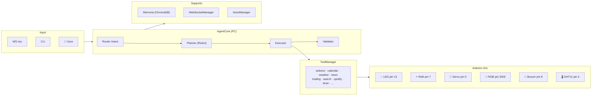

# M.A.Y.A. — Multitask Advanced Yielding Assistant


**Sistema domotico intelligente per una casa fisica interattiva**, con dashboard HUD dinamica e controllo centralizzato di luci, servo, RGB, buzzer e sensori.  
Costruito su **Ollama** + **FastAPI** con architettura agentica **Planner → Executor → Validator**, pensato per l'**Arduino Day 2026**.

> *Elaborato da Gabriele Rossoni e Marcello Patrini — 4IB, ITIS di Crema*

---

## Idea Centrale

M.A.Y.A. non è un chatbot generico: è il **cervello unico che orchestra la casa**.  
Una casa intelligente in miniatura dove il PC fa i calcoli pesanti e Arduino gestisce il mondo fisico — luci, porte, sensori, RGB, buzzer.

La differenza rispetto ai sistemi già esistenti:

- **Controllo locale e privacy** — il cuore del sistema funziona offline, senza cloud
- **Gestione multi-scenario** — non un singolo dispositivo acceso/spento, ma un ambiente coordinato
- **Dashboard HUD dinamica** — pannello "STATO CASA // LIVE" con stato real-time di ogni dispositivo
- **Linguaggio naturale in italiano** — comandi normali, senza formule rigide
- **7 scene configurate** — modalità studio, notte, film, relax, uscita, ospite, allarme

---

## Architettura



**Divisione dei ruoli:**

| | PC | Arduino |
|---|---|---|
| **Ruolo** | Unità intelligente | Unità fisica |
| **Fa** | Interpreta comandi, gestisce logica, LLM | Accende, muove, legge, risponde |
| **Comunicazione** | Seriale USB (JSON 115200 baud) | Seriale USB (JSON 115200 baud) |

---

## Hardware & Pin Mapping

### Schema di collegamento

```
Arduino Uno / Nano
├── Pin 13  →  LED             (luce principale — digitale)
├── Pin  7  →  Relè            (attuatore generico — digitale)
├── Pin  9  →  Servo SG90      (porta / accesso — PWM)
├── Pin  5  →  RGB canale R    (PWM analogWrite)
├── Pin  6  →  RGB canale G    (PWM analogWrite)
├── Pin  3  →  RGB canale B    (PWM analogWrite)
├── Pin  8  →  Buzzer          (allarme — digitale, auto-off 200 ms)
├── Pin  4  →  DHT11           (temperatura e umidità — OneWire)
└── USB     →  Seriale PC      (115200 baud)
```

### Tabella componenti

| Dispositivo | Pin | Tipo segnale | Note |
|---|---|---|---|
| LED (luce principale) | 13 | Digitale OUT | HIGH = acceso |
| Relè | 7 | Digitale OUT | HIGH = attivato |
| Servo SG90 (porta) | 9 | PWM / Servo | 0° = chiusa, 90° = aperta |
| RGB — canale R | 5 | PWM (analogWrite) | 0–255 |
| RGB — canale G | 6 | PWM (analogWrite) | 0–255 |
| RGB — canale B | 3 | PWM (analogWrite) | 0–255 |
| Buzzer | 8 | Digitale OUT | Cicalino, auto-off dopo 200 ms |
| DHT11 | 4 | OneWire | Temp. + umidità; telemetria ogni 5 s |

### Dipendenze firmware

```
ArduinoJson  6.x   (parsing JSON)
Servo.h             (libreria built-in)
DHT.h               (Adafruit DHT sensor library)
```

---

## Protocollo Arduino

Comunicazione seriale **115200 baud**, una riga JSON per messaggio, terminata con `\n`.

### Richiesta (PC → Arduino)

```json
{"id": 1, "cmd": "SET", "target": "light", "value": 1}
```

| Campo | Valori |
|---|---|
| `cmd` | `"SET"` oppure `"GET"` |
| `target` | `"light"` · `"relay"` · `"servo"` · `"rgb"` · `"buzzer"` · `"sensor_read"` |
| `value` | `0`/`1` per digitali · `0–180` per servo · intero `0xRRGGBB` o oggetto `{"r":R,"g":G,"b":B}` per RGB |

### Risposta (Arduino → PC)

```json
{
  "id": 1,
  "status": "ok",
  "state": {
    "light": true,
    "relay": false,
    "servo": 90,
    "rgb": [255, 238, 153],
    "buzzer": false
  }
}
```

### Telemetria (non richiesta, ogni 5 s)

```json
{"telemetry": {"temp": 22.4, "humidity": 58.1, "uptime_ms": 12000}}
```

### Risposta errore

```json
{"id": -1, "status": "error", "msg": "parse_fail"}
```

Senza Arduino connesso il sistema entra automaticamente in **modalità simulazione** — nessuna modifica al codice necessaria.

---

## Scene e Automazioni

Le scene sono attivabili via linguaggio naturale (*"Maya, modalità studio"*), pulsanti dashboard o voce.

| Scena | Luci | Relay | Servo | RGB | Buzzer | Altro |
|---|---|---|---|---|---|---|
| `modalità notte` | ❌ | ❌ | 0° | `#000022` blu scuro | — | Spotify pause |
| `modalità studio` | ✅ | ❌ | — | `#FFEE99` caldo | — | — |
| `modalità film` | ❌ | ✅ | — | `#220000` rosso tenue | — | — |
| `modalità relax` | ❌ | ✅ | — | `#440055` viola | — | — |
| `modalità uscita` | ❌ | ❌ | 0° | spento | ✅ 1 bip | — |
| `modalità ospite` | ✅ | ✅ | 90° | `#FFFFFF` bianco | — | — |
| `allarme` | — | — | — | `#FF0000` rosso | ✅ | — |

---

## Caratteristiche

- **Agentic ReAct Loop** — ciclo asincrono Ragiona → Agisci → Osserva con routing ibrido dell'intent
- **Voice I/O Integrato** — STT via `faster-whisper` (tiny) e TTS via `Piper` (voce Paola) con VAD adattivo
- **Memoria Semantica Vettoriale** — ChromaDB per recupero contesto a lungo termine + sliding window
- **Dashboard HUD Dinamica** — idle con orologio e particelle; work con orb 3D Three.js; pannelli live per Meteo, Notizie, Trading, Stato Casa, Calendario, Spotify
- **Stato Casa Live** — pannello "STATO CASA // LIVE" aggiornato in tempo reale: luci, relay, servo, RGB swatch, buzzer, temperatura, umidità
- **Telemetria Automatica** — DHT11 invia temperatura e umidità ogni 5 s; `sensor_broadcaster` pubblica ai client ogni 30 s
- **Graceful Degradation** — senza Arduino → simulazione automatica; senza Ollama → fallback a parser keyword

---

## Stack Tecnologico

| Livello | Tecnologia |
|---|---|
| Modelli LLM | Ollama (llama3.2, phi4, mistral-small) |
| API Backend | FastAPI + Uvicorn |
| Tempo reale | WebSockets (nativo FastAPI) |
| Hardware | PySerial + Arduino Uno (C++) |
| Finanza | CoinGecko API + yfinance |
| Meteo | Open-Meteo API (geocoding + forecast) |
| Notizie | feedparser (RSS ANSA) |
| Ricerca | DuckDuckGo Search |
| Traduzione | deep-translator (Google backend) |
| Monitoraggio | psutil |
| Media | Spotify API (opzionale) |
| Interfaccia | Three.js (orb 3D) + Leaflet.js (mappe) + TradingView Widget |
| Persistenza | ChromaDB (vettoriale) + JSON locale |
| Voce | Faster-Whisper (STT) + Piper TTS |
| Multi-stanza | MQTT — paho-mqtt (opzionale) |

> **Opzionale:** Groq API (fallback cloud LLM), Electron (wrapper desktop), Ngrok (tunnel remoto), Spotify API.

---

## Struttura Repository

```
maya/
├── main.py                    # Entrypoint: FastAPI, lifecycle, WS, broadcaster
├── instance_guard.py          # Lock single-instance
├── MAYA_DESKTOP.bat           # Launcher rapido Windows
│
├── core/
│   ├── agent_core.py          # Planner/Executor/Validator, routing, AUTOMATIONS
│   ├── tool_manager.py        # Registry e dispatcher di tutti i tool
│   ├── memory_manager.py      # Memoria semantica ChromaDB + sliding window
│   ├── voice_manager.py       # Voice I/O: Whisper STT + Piper TTS + VAD
│   ├── websocket_manager.py   # Broadcast manager WebSocket
│   ├── plugin_loader.py       # Caricamento dinamico plugin
│   ├── proactive_manager.py   # Monitor proattivo CPU/RAM/calendario
│   └── log_utils.py           # Filtro log per dashboard
│
├── tools/
│   ├── arduino_tool.py        # Seriale USB → Arduino (auto-discovery + sim mode)
│   ├── mqtt_tool.py           # Controllo multi-room via MQTT
│   ├── network_tool.py        # TCP client + server (secondo PC)
│   ├── system_tool.py         # Comandi OS (shutdown, browser, screenshot, volume)
│   ├── calendar_tool.py       # Calendario locale JSON
│   ├── weather_tool.py        # Open-Meteo geocoding + forecast
│   ├── news_tool.py           # RSS reader (ANSA)
│   ├── wikipedia_tool.py      # Wikipedia summary (IT)
│   ├── notes_tool.py          # Todo list e appunti JSON
│   ├── trading_tool.py        # CoinGecko + yfinance + TradingView
│   ├── timer_tool.py          # Timer asincrono
│   ├── translate_tool.py      # deep-translator
│   ├── search_tool.py         # DuckDuckGo web search
│   ├── spotify_tool.py        # Spotify API + media keys
│   ├── sys_monitor_tool.py    # CPU % + RAM % via psutil
│   ├── display_tool.py        # ASCII status panel (terminale)
│   └── code_generator_tool.py # Generazione tool a runtime
│
├── arduino/
│   └── maya_controller.ino    # Firmware: LED, relay, servo, RGB, buzzer, DHT11
│
├── static/
│   ├── jarvis_dashboard.html  # SPA dashboard HUD — slider, Three.js orb, pannelli live
│   ├── sfondo-maya.png
│   ├── maya_logo.png
│   └── maya_logo_no_sfondo.png
│
├── voice/
│   ├── piper.exe              # TTS engine
│   ├── it_IT-paola-medium.onnx
│   └── hey_maya.onnx          # Wake word model
│
├── data/                      # Runtime data (gitignored)
│   ├── chroma_db/
│   ├── memory_metadata.json
│   ├── calendar.json
│   └── notes.json
│
├── tests/
├── plugins/
├── requirements.txt
├── .env.example
└── .gitignore
```

---

## Installazione e Avvio

### Prerequisiti

- Python **3.10+**
- [Ollama](https://ollama.com/) installato e avviato (`ollama serve`)
- Arduino Uno/Nano con firmware caricato *(opzionale — degrada in simulazione automaticamente)*

### 1. Clone e dipendenze

```bash
git clone https://github.com/gabrielerossoni/maya-ai-assistant.git
cd maya-ai-assistant
pip install -r requirements.txt
```

### 2. Configurazione

```bash
cp .env.example .env
```

Variabili **essenziali**:

```env
OLLAMA_HOST=127.0.0.1
ARDUINO_PORT=AUTO          # oppure COM3, /dev/ttyACM0, ecc.
ASSISTANT_NAME=MAYA
DEFAULT_WEATHER_LOCATION=Roma
NEWS_FEED_URL=https://www.ansa.it/sito/ansait_rss.xml
```

Variabili **opzionali**:

```env
SPOTIFY_ENABLED=false       # true solo se hai credenziali Spotify
GROQ_API_KEY=               # fallback cloud LLM
```

### 3. Download modelli Ollama

```bash
ollama pull llama3.2
ollama pull phi4
ollama pull mistral-small
ollama pull nomic-embed-text   # per memoria semantica
```

### 4. Firmware Arduino *(opzionale)*

1. Aprire `arduino/maya_controller.ino` con Arduino IDE
2. Installare librerie: **ArduinoJson 6.x**, **DHT sensor library** (Adafruit), **Servo** (built-in)
3. Caricare su Arduino Uno/Nano
4. Impostare `ARDUINO_PORT=AUTO` nel `.env` (auto-discovery via USB)

### 5. Avvio

```bash
python main.py
```

La dashboard si apre automaticamente su `http://127.0.0.1:8000`.

> **Wrapper desktop (opzionale):** installa Node.js, esegui `npm install` nella root, poi avvia con `MAYA_DESKTOP.bat`.

---

## WebSocket API

Il frontend si connette a `ws://127.0.0.1:8000/ws`.

### Messaggi server → client

```json
{ "type": "log",           "text": "...", "level": "ok|info|warn" }
{ "type": "stream",        "token": "...", "full_text": "..." }
{ "type": "stats",         "neural_load": 12.4, "memory": 45.2 }
{ "type": "state",         "led": "on", "relay": "off", "servo": "0",
                            "rgb": [255, 238, 153], "buzzer": false }
{ "type": "arduino_event", "telemetry": { "temp": 22.4, "humidity": 58.1, "uptime_ms": 12000 } }
{ "type": "weather",       "data": { ... } }
{ "type": "trading",       "symbol": "BTC", "price": 68000, "change_pct": 2.4 }
{ "type": "news",          "articles": [ ... ] }
{ "type": "calendar_data", "events": [ ... ] }
{ "type": "spotify",       "track": "...", "artist": "...", "is_playing": true }
{ "type": "voice_status",  "status": "listening|speaking|idle" }
{ "type": "layout",        "layout": "orb|weather|news|dashboard", "params": { ... } }
```

### Messaggi client → server

```json
{ "type": "command", "text": "accendi la luce" }
{ "type": "tool",    "action": { "tool": "trading", "operation": "overview" } }
{ "type": "tool",    "action": { "tool": "calendar", "operation": "list" } }
```

---

## Aggiungere un Tool

1. Creare `tools/my_tool.py` con classe `MyTool` che implementa `initialize()` e `execute()`
2. Registrarlo in `core/tool_manager.py`:
   ```python
   from tools.my_tool import MyTool
   # in initialize():
   "my_tool": MyTool(),
   ```
3. Aggiungerlo al `SYSTEM_PROMPT` in `core/agent_core.py` nella sezione "Tool disponibili"

### Interfaccia Tool

```python
class MyTool:
    def initialize(self) -> None: ...
    def execute(self, action: dict) -> dict: ...
    # Per tool asincroni:
    async def execute(self, action: dict) -> dict: ...
```

Contratto di risposta:

```json
{ "status": "ok" | "error" | "warning", "message": "..." }
```

---

## Formato JSON LLM

Il system prompt forza l'LLM a rispondere in questo schema:

```json
{
  "intent": "descrizione breve del task",
  "layout": "orb | weather | map | browser | news | dashboard",
  "layout_params": {},
  "actions": [
    { "tool": "weather", "location": "Roma" },
    { "tool": "arduino", "op": "SET", "target": "light", "value": 1 }
  ],
  "reply": "Risposta naturale in italiano"
}
```

In caso di fallback (Ollama non disponibile), `_fallback_parse()` gestisce le keyword più comuni senza LLM.

---

## Note Tecniche

- Il **routing dell'intent** usa logica ibrida: instradamento diretto per task comuni, router LLM per quelli complessi
- Il **ReAct Loop** evita il doppio routing: l'intent viene determinato una sola volta fuori dal ciclo
- **Uscita anticipata**: se il tool produce un risultato sufficiente al primo step, il sistema non riformula
- `VoiceManager` include calibrazione VAD automatica per adattarsi al rumore ambientale
- `ChromaDB` garantisce che l'agente ricordi fatti avvenuti giorni o settimane prima
- Catena di fallback: **Ollama (locale) → Groq (cloud) → Parser keyword (offline)**
- `sensor_broadcaster` chiama `get_sensor_data()` in thread separato ogni 30 s per non bloccare l'event loop

---

## Milestone di Progetto

| Data | Verifica | Obiettivo | Stato |
|---|---|---|---|
| 16/05/2026 | Verifica 1 | Schema scelto, hardware collegato, dashboard aperta, ≥ 1 dispositivo risponde | ✅ |
| 23/05/2026 | Verifica 2 | Flusso completo: comando → LLM → Arduino → feedback real-time sulla dashboard | 🔲 |
| 30/05/2026 | Verifica 3 | Demo stabile, correzione bug, prova con pubblico interno, video di backup pronto | 🔲 |
| 04/06/2026 | Arduino Day | Solo rifinitura e presentazione. **Niente nuove funzioni** | 🔲 |

---

## Roadmap

### ✅ Completati

- [x] Architettura agentica ReAct con routing ibrido
- [x] Voce bidirezionale (Whisper STT locale + Piper TTS)
- [x] Memoria semantica (ChromaDB + embedding Ollama)
- [x] Monitoraggio proattivo (CPU/RAM/calendario)
- [x] Dashboard HUD bimodale con orb 3D e slider animato
- [x] Panoramica trading live (CoinGecko + yfinance)
- [x] Meteo HUD con mappa Leaflet e previsioni
- [x] Notizie HUD con articolo in evidenza + ticker
- [x] Firmware Arduino JSON 115200 baud (LED, relay, servo, RGB, buzzer, DHT11)
- [x] Protocollo telemetria automatica da DHT11 ogni 5 s
- [x] Pannello "STATO CASA // LIVE" con stato real-time di tutti i dispositivi
- [x] 7 scene configurate con controllo RGB e buzzer
- [x] `sensor_broadcaster` — aggiornamento temperatura/umidità ogni 30 s
- [x] `SPOTIFY_ENABLED` flag — Spotify disattivabile via `.env`

### 🔲 In corso / Prossimi

- [ ] Verifica demo completa con pubblico interno (30/05/2026)
- [ ] Allineamento firmware → test su hardware reale
- [ ] Streaming LLM token-by-token via WebSocket
- [ ] Multi-room Arduino con broker MQTT
- [ ] Google Calendar sync (OAuth2)

### 🔮 Futuro

- [ ] Dashboard mobile (PWA)
- [ ] Plugin system hot-reload senza restart
- [ ] Notifiche push su cambio stato casa
- [ ] Memoria preferenze utente persistente

---

## .gitignore — Cosa viene escluso

```
data/          # chroma_db, memory_metadata, calendar, notes
.env           # credenziali e configurazioni locali
.venv/         # virtualenv
__pycache__/
node_modules/
.vscode/
.windsurf/
logs/
```

---

## Autori

Progetto sviluppato da studenti dell'**ITIS di Crema** per l'**Arduino Day 2026**.

| | |
|---|---|
| **Gabriele Rossoni** — *Project Manager & Lead Developer* | Ideazione, architettura e sviluppo principale del sistema. |
| **Marcello Patrini** — *Co-Developer* | Contributi allo sviluppo e testing. |

[](https://github.com/gabrielerossoni)

---

<p align="center">
  <strong>M.A.Y.A.</strong> — Un cervello per la casa, non l'ennesimo chatbot.<br>
  <em>ITIS di Crema • Arduino Day 2026</em>
</p>