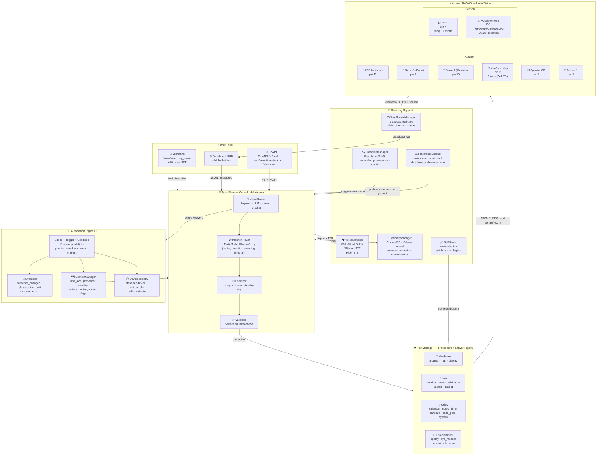

# M.A.Y.A. — Multitask Advanced Yielding Assistant


**Sistema domotico intelligente per una casa fisica interattiva**, con dashboard HUD dinamica e controllo centralizzato di luci, servomotori, strisce LED NeoPixel, buzzer, speaker e sensori di telemetria.  
Costruito su **Ollama** + **FastAPI** con architettura agentica **Planner → Executor → Validator**, presentato all'**Arduino Day 2026**.

> **Ultimo aggiornamento:** 5 Giugno 2026 — **Versione definitiva post Arduino Day 2026**. M.A.Y.A. è stato presentato come prototipo di smart home AI con plastico fisico interattivo, dashboard HUD live e controllo hardware tramite Arduino. Restano operativi firmware **Arduino Uno R4 WiFi**, **NeoPixel a 3 zone**, doppio servo (**Porta e Cancello**), quake detection fisica (**MPU6050/LSM6DSOX**), sintesi vocale, **Automation Engine OO**, meteo/news/calendario live, monitoraggio GPU e dashboard WebSocket real-time.

> *Elaborato da Gabriele Rossoni e Marcello Patrini — 4IB, ITIS di Crema*

---

## Idea Centrale

M.A.Y.A. non è un chatbot generico: è il **cervello unico che orchestra la casa**.  
Una casa intelligente in miniatura dove il PC esegue i calcoli pesanti e i modelli linguistici, e Arduino gestisce il mondo fisico — luci, porte, cancelli, sensori, strisce RGB e speaker di segnalazione.

La differenza rispetto ai sistemi già esistenti:

- **Controllo locale e privacy** — il cuore del sistema funziona offline, senza cloud obbligatori.
- **Gestione multi-scenario** — non un singolo dispositivo acceso/spento, ma un ambiente coordinato tramite scene.
- **Dashboard HUD dinamica** — pannello "STATO CASA // LIVE" con stato real-time di ogni dispositivo.
- **Rilevamento sismico integrato** — accelerometro fisico che attiva allarmi e notifiche vocali in tempo reale in caso di scosse.
- **Linguaggio naturale in italiano** — comandi normali, senza formule rigide.
- **11 scene OO** — film, relax, allarme + scene giornaliere (buongiorno, buonanotte, sveglia, cena, piove, ospiti in arrivo, vado fuori, sono rientrato) con priorità, cooldown e trigger automatici.

---

## Presentazione Arduino Day 2026

M.A.Y.A. è stato presentato all'**Arduino Day 2026** come prototipo completo di casa intelligente: una smart home fisica in miniatura coordinata da un assistente AI, con dashboard live e dispositivi reali controllati da Arduino.

Durante l'esposizione il progetto ha mostrato:

- una **casa fisica interattiva**, non solo una simulazione software;
- una **dashboard HUD live** per visualizzare stato casa, scene, meteo, news, calendario e telemetria;
- controllo reale di **luci, NeoPixel RGB, porta, cancello, buzzer, speaker e sensori**;
- scene domotiche complete come `buongiorno`, `buonanotte`, `piove`, `ospiti in arrivo`, `film`, `relax` e `allarme`;
- un'idea chiara e comunicabile: **il PC ragiona, Arduino agisce**.

Il valore principale emerso nella demo è stato l'effetto integrato: plastico, AI, hardware e interfaccia non lavorano come pezzi separati, ma come un unico sistema. Anche davanti a un pubblico non tecnico, il funzionamento è risultato comprensibile perché ogni comando produceva una conseguenza visibile sulla casa e sulla dashboard.

> **Caption portfolio:** M.A.Y.A. presented at Arduino Day 2026: an AI-powered smart home prototype combining a physical interactive model, Arduino-controlled devices and a live HUD dashboard.

---

## Architettura


```mermaid
flowchart TD
    %% ── INPUT ──────────────────────────────────────────────────────────────
    subgraph IN["🎯 Input Layer"]
        direction LR
        MIC["🎤 Microfono\nWakeWord hey_maya\n+ Whisper STT"]
        WEB["🌐 Dashboard HUD\nWebSocket /ws"]
        REST["🔌 HTTP API\nFastAPI / · /health\n/api/news/live-streams · /shutdown"]
    end

    %% ── AGENT CORE ─────────────────────────────────────────────────────────
    subgraph CORE["🧠 AgentCore — Cervello del sistema"]
        direction TB
        ROUTER["🔀 Intent Router\nkeyword · LLM · scene · chitchat"]
        PLANNER["📋 Planner ReAct\nMulti-Model Ollama/Groq\n(router, domotic, reasoning, chitchat)"]
        EXEC["⚙️ Executor\nesegue il piano step-by-step"]
        VALID["✅ Validator\nverifica risultato atteso"]
        ROUTER --> PLANNER --> EXEC --> VALID
    end

    %% ── AUTOMATION ENGINE ───────────────────────────────────────────────────
    subgraph AUT["🤖 AutomationEngine OO"]
        direction TB
        AE["Scene + Trigger + Condition\n11 scene predefinite\npriorità · cooldown · retry · timeout"]
        BUS["📡 EventBus\npresence_changed · phone_joined_wifi\napp_opened · ..."]
        CTX["🗺️ ContextManager\ntime_slot · presence · weather\nactivity · active_scene · flags"]
        REG["📦 DeviceRegistry\nstato per-device · last_set_by\nconflict detection"]
        AE --> BUS
        AE --> CTX
        AE --> REG
    end

    %% ── TOOL MANAGER ────────────────────────────────────────────────────────
    subgraph TM["🛠️ ToolManager — 17 tool core + network opt-in"]
        direction LR
        HW_T["🔌 Hardware\narduino · mqtt · display"]
        INFO["📡 Info\nweather · news · wikipedia\nsearch · trading"]
        UTIL["🧰 Utility\ncalendar · notes · timer\ntranslate · code_gen · system"]
        ENT["🎵 Entertainment\nspotify · sys_monitor\nnetwork solo opt-in"]
    end

    %% ── ARDUINO ─────────────────────────────────────────────────────────────
    subgraph ARD["⚡ Arduino R4 WiFi — Unità Fisica"]
        direction LR
        subgraph ATTUATORI["Attuatori"]
            LED["💡 LED Indicatore\npin 13"]
            SERVO["🚪 Servo 1 (Porta)\npin 9"]
            SERVO2["🚧 Servo 2 (Cancello)\npin 10"]
            NEOPIXEL["🌈 NeoPixel strip\npin 2\n3 zone (24 LED)"]
            SPK["🔊 Speaker 8Ω\npin 3"]
            BUZZ["🔔 Buzzer 1\npin 8"]
        end
        subgraph SENSORI["Sensori"]
            DHT["🌡️ DHT11\npin 4\ntemp + umidità"]
            IMU["🫨 Accelerometro\nI2C (MPU6050/LSM6DSOX)\nQuake detection"]
        end
    end

    %% ── SUPPORTO ────────────────────────────────────────────────────────────
    subgraph SUP["🔧 Servizi di Supporto"]
        direction LR
        VM["🗣️ VoiceManager\nWakeWord ONNX\nWhisper STT\nPiper TTS"]
        MEM["🧩 MemoryManager\nChromaDB + Ollama embed\nmemoria semantica conversazioni"]
        WSM["📺 WebSocketManager\nbroadcast real-time\nstats · sensori · scene"]
        PROA["🔍 ProactiveManager\nGroq llama-3.1-8b\nanomalie · promemoria · orario"]
        HEAL["🩹 SelfHealer\nmanual/opt-in\npatch tool in plugins/"]
        PREF["📊 PreferenceLearner\nuso scene · orari · tool\ndata/user_preferences.json"]
    end

    %% ── FLUSSO PRINCIPALE ───────────────────────────────────────────────────
    MIC -->|"testo trascritto"| CORE
    WEB -->|"JSON messaggio"| CORE
    REST -->|"HTTP POST"| CORE

    ROUTER -->|"scene keyword"| AUT
    VALID -->|"tool action"| TM

    TM -->|"JSON 115200 baud seriale/MQTT"| ARD
    ARD -->|"telemetria DHT11 + scosse"| WSM

    CORE <-->|"snapshot contesto"| CTX
    CORE <-->|"memoria conversazioni"| MEM
    CORE <-->|"risposta TTS"| VM

    WSM -->|"broadcast WS"| WEB
    PROA -->|"suggerimenti autonomi"| CORE
    HEAL -->|"hot-reload plugin"| TM
    PREF -->|"preferenze utente nel prompt"| CORE
```

**Divisione dei ruoli:**

| | PC | Arduino |
|---|---|---|
| **Ruolo** | Unità intelligente | Unità fisica |
| **Fa** | Interpreta comandi, gestisce logica, LLM | Accende, muove, legge, risponde |
| **Comunicazione** | Seriale USB / MQTT WiFi (JSON) | Seriale USB / MQTT WiFi (JSON) |

---

## Hardware & Pin Mapping

### Schema di collegamento

```
Arduino Uno R4 WiFi (o Arduino Uno/Nano + moduli compatibili)
├── Pin 13  →  LED Indicator         (stato/alimentazione — digitale)
├── Pin  2  →  NeoPixel strip WS2812  (Led RGB, 24 LED totali — 3 zone logiche)
├── Pin  9  →  Servo 1 (Porta SG90)  (controllo accesso porta — PWM)
├── Pin 10  →  Servo 2 (Cancello)    (controllo cancello d'ingresso — PWM)
├── Pin  3  →  Speaker Gikfun 8Ω 2W  (melodie via tone(), ex buzzer2 — PWM)
├── Pin  8  →  Buzzer 1 (Allarme)     (cicalino di allarme — digitale, auto-off 200 ms)
├── Pin  4  →  DHT11                 (temperatura e umidità — OneWire)
├── I2C Bus →  MPU6050 / LSM6DSOX    (accelerometro/giroscopio sismico — I2C SDA/SCL)
└── USB/WiFi → Seriale / MQTT Broker (comunicazione bidirezionale, 115200 baud / WiFi)
```

### Tabella componenti

| Dispositivo | Pin / Interfaccia | Tipo segnale | Note |
|---|---|---|---|
| LED Indicatore | 13 | Digitale OUT | HIGH = acceso |
| NeoPixel WS2812B | 2 | Digitale OUT | 24 LED totali, divisi in: Zone 1 (0-7, rgb1), Zone 2 (8-15, rgb2), Zone 3 (16-23, rgb3) |
| Servo 1 (Porta) | 9 | PWM / Servo | 0° = chiusa, 90° = aperta |
| Servo 2 (Cancello) | 10 | PWM / Servo | 0° = chiuso, 90° = aperto |
| Speaker Gikfun 8Ω | 3 | PWM (tone) | Melodie di sistema (`startup`, `welcome`, `ok`, `notify`, `error`, `alarm`, `wake_radar`) |
| Buzzer 1 | 8 | Digitale OUT | Sirena allarme continuo con auto-off 200 ms |
| DHT11 | 4 | OneWire | Temperatura e umidità; telemetria inviata ad ogni richiesta o ogni 5 s |
| Accelerometro | I2C (SDA/SCL) | I2C Protocol | MPU6050 esterno o LSM6DSOX integrato; rileva scosse sismiche > `0.15g` |

### Dipendenze firmware

```cpp
ArduinoJson        6.x   (parsing dei comandi JSON)
Adafruit_NeoPixel  1.x   (controllo striscia LED RGB indirizzabile)
Servo.h                  (controllo dei servomotori)
DHT.h                    (lettura sensore Adafruit DHT11)
PubSubClient       2.x   (client MQTT per connessione WiFi)
WiFiS3                   (gestione scheda WiFi integrata su Uno R4)
Adafruit_MPU6050         (gestione accelerometro esterno via I2C)
```

---

## Protocollo Arduino

Comunicazione seriale **115200 baud** o **MQTT (WiFi)**, una riga JSON per messaggio, terminata con `\n`.

### Richiesta (PC → Arduino)

```json
{"id": 1, "cmd": "SET", "target": "light", "value": 1}
```

| Campo | Valori |
|---|---|
| `cmd` | `"SET"`, `"GET"`, oppure `"BATCH"` |
| `target` | `"light"`, `"servo"`, `"servo2"`, `"rgb"`, `"rgb1"`, `"rgb2"`, `"rgb3"`, `"neopixel"`, `"brightness"`, `"buzzer"`, `"buzzer2"`/`"speaker"`, `"sensor_read"`, `"status"` |
| `value` | `0`/`1` per digitali · `0–180` per servo · intero `0xRRGGBB` o oggetto `{"r":R,"g":G,"b":B}` per RGB. |
| `effect` | *Opzionale per RGB:* `0` (solido), `1` (pulse), `2` (rainbow), `3` (alert) |
| `melody` | *Opzionale per speaker:* nome melodia (es. `startup`, `alarm`, `wake_radar`, `welcome`, `ok`, `notify`, `error`) |

### Risposta (Arduino → PC)

```json
{
  "id": 1,
  "status": "ok",
  "state": {
    "light": true,
    "servo": 90,
    "servo2": 0,
    "rgb1": [255, 238, 153],
    "rgb2": [0, 0, 0],
    "rgb3": [0, 0, 0],
    "neo_effect": 0,
    "buzzer": false,
    "buzz2_playing": false
  }
}
```

### Telemetria (Arduino → PC, automatica ogni 5 s)

```json
{"telemetry": {"temp": 22.4, "humidity": 58.1, "uptime_ms": 12000}}
```

Se si verifica un evento sismico rilevato dall'accelerometro (superamento della soglia `0.15g` per almeno 500ms):

```json
{"event": "quake", "magnitude": 4.2, "peak_g": 0.18}
```

---

## Scene e Automazioni

Le scene sono attivabili via linguaggio naturale (*"Maya, buonanotte"*, *"Maya, allarme"*), pulsanti dashboard o vocalmente.

### Scene Ambiente

| Scena | Luci (Pin 13) | Servo 1 (Porta) | Servo 2 (Cancello) | RGB NeoPixel | Buzzer/Speaker | Altro |
|---|---|---|---|---|---|---|
| `buonanotte` / `notte` | ❌ | 0° | 0° | `#000010` (blue, all zones) | — | Spotify pause, luminosità 32, sync calendario |
| `modalità film` | ❌ | — | — | `#220000` (red on rgb1/rgb2) | — | — |
| `modalità relax` | ❌ | — | — | `#440055` (purple on rgb1/rgb2) | — | — |
| `allarme` | — | — | — | `#FF0000` Lampeggiante (effect 3) | ✅ Melodia alarm + Buzzer 1 | Avvio sequenza visiva sismica |

### Scene Giornaliere

| Scena | Azione principale | Extra |
|---|---|---|
| `buongiorno` | Luce + NeoPixel alba `#FFD580` | Lettura vocale meteo, notizie, eventi calendario, Spotify mattina |
| `sveglia` | Buzzer 1 + luce + RGB alba pulsante | Speaker melody `wake_radar`, Spotify energetico |
| `cena` | NeoPixel arancione `#FF8C42` soffuso (rgb1/rgb2) | Spotify cena romantica |
| `ospiti in arrivo` | Luce indicatore + NeoPixel bianco `#FFFFFF`, Porta + Cancello a 90° | Speaker melody `startup` |
| `vado fuori` | Tutto spento (luce, NeoPixel, Servo 1 e 2 chiusi) | Speaker melody `ok`, Spotify pause, meteo |
| `sono rientrato` | Luce indicatore + Porta aperta (90°) + NeoPixel `#FF8C42` | Avvio timer 5 minuti per richiudere la porta, Spotify relax |
| `piove` | Porta chiusa (0°), luce indicatore + NeoPixel blu `#4488FF` | Spotify lofi study playlist, meteo |

### Rilevamento Terremoti (Quake Detection)

MAYA include un meccanismo di sicurezza basato su accelerometro fisico (LSM6DSOX o MPU6050).
1. Quando l'accelerometro rileva una vibrazione superiore a `0.15g` per almeno `500 ms`, la scheda Arduino pubblica un evento `"event": "quake"`.
2. Il server `main.py` intercetta l'evento ed esegue istantaneamente in background lo scenario di **allarme** sismico.
3. Il sistema attiva l'allarme acustico e fa lampeggiare i NeoPixel in rosso, mentre `VoiceManager` effettua un annuncio vocale prioritario: *"Attenzione: rilevata scossa di magnitudo X sulla scala Richter"* o *"Attenzione: rilevata scossa sismica"*.
4. Dopo 20 secondi, se non si registrano ulteriori scosse, lo scenario viene automaticamente azzerato.

---

## Caratteristiche

- **Agentic ReAct Loop** — ciclo asincrono Ragiona → Agisci → Osserva con routing ibrido dell'intent (LLM per compiti complessi, keyword router per compiti immediati).
- **Automation Engine OO** — 11 scene con priorità, cooldown, condizioni contestuali, trigger temporali/evento, retry e timeout per azione, event bus interno e scheduler asincrono.
- **Connessione Seriale Self-Healing** — rilevamento automatico delle disconnessioni fisiche o dei timeout della seriale con ripristino silente e trasparente in background della porta `COM` reale, senza mai bloccare l'interfaccia utente.
- **Riconoscimento Hardware Universale** — algoritmo di auto-discovery aggiornato per supportare nativamente descrizioni di sistema sia in Inglese che in Italiano (es. `"Dispositivo seriale USB"` su Windows), assicurando la connessione automatica all'avvio.
- **Servo-Controllo Zero-Blocking** — lettura dello stato precedente da cache in memoria locale (`sim_state`) anziché tramite query seriali bloccanti (`GET status`), azzerando i ritardi e le collisioni di comandi fisici sul servo.
- **Sincronizzazione della Cronologia** — memorizzazione persistente dei turni di chat sul server e recupero automatico con rendering istantaneo dei log e dei messaggi all'avvio del WebSocket o al refresh della dashboard.
- **Effetti Speciali RGB** — supporto a livello firmware e di parsing diretto per triggerare effetti avanzati sulla striscia LED (Rainbow cangiante, Pulsazione/Respiro rilassante, Allerta lampeggiante rosso) sia per singole zone che globalmente.
- **Context Manager** — stato globale casa thread-safe e persistente: time slot, presenza, meteo, attività, scena attiva, flag custom.
- **Device Registry** — memoria persistente dei dispositivi con tracciamento `last_set_by` e conflict detection tra scene.
- **Voice I/O Integrato** — STT via `faster-whisper` (small) e TTS via `Piper` (voce Paola) con VAD adattivo.
- **Memoria Semantica Vettoriale** — ChromaDB per recupero contesto a lungo termine + sliding window.
- **Dashboard HUD Dinamica** — idle con orologio e particelle; work con orb 3D Three.js; 11 chip scene più controllo OFF con feedback visivo live (`scene_executed`), pannelli Meteo, Notizie, Stato Casa, Calendario, Spotify, ottimizzata graficamente in modalità PWA per iPhone 13 (notches, safe-areas e tap highlight rimossi).
- **News italiane + internazionali** — aggregazione RSS bilanciata: le fonti `MONDO` restano visibili anche quando il feed italiano è più denso; il testo viene decodificato e ripulito prima della dashboard.
- **Live news sempre live** — i riquadri YouTube usano solo canali live; se il primario non risponde, `/api/news/live-streams` seleziona un fallback live.
- **Google Calendar Sync** — OAuth2 con token locale; mostra solo il calendario selezionato via `GOOGLE_CALENDAR_ID` nel `.env`.
- **Electron Desktop Wrapper** — finestra nativa senza browser, icona MAYA nella taskbar, F12 alwaysOnTop, Escape per reset layout.
- **Stato Casa Live** — pannello aggiornato in tempo reale: luci, servos, strisce NeoPixel RGB, buzzer, speaker, temperatura, umidità.
- **Telemetria Automatica** — DHT11 invia temperatura e umidità ogni 5 s; `sensor_broadcaster` publishes ai client ogni 30 s.
- **Safety by default** — tunnel pubblico ngrok, `self_healer.py`, `code_generator`, `plugin_loader.py` e `network_tool.py` sono disattivati di default e richiedono flag esplicite (`MAYA_NGROK_ENABLED=true`, `DISABLE_SELF_HEALER=false`, `CODE_GENERATOR_ENABLED=true`, `PLUGIN_LOADER_ENABLED=true`/`DEV_MODE=true`, `NETWORK_TOOL_ENABLED=true`).
- **Graceful Degradation** — senza Arduino → card dashboard mostrano `—` (nessun dato fittizio); `OLLAMA_ENABLED=false` → Groq cloud se configurato → parser keyword/offline per i comandi diretti.
- **Broadcast stato real-time** — ogni comando vocale/testuale aggiorna immediatamente le card della dashboard via WebSocket.

---

## Stack Tecnologico

| Livello | Tecnologia |
|---|---|
| Modelli LLM | Ollama (llama3.2:1b, phi4, mistral-small, llama3.2) o Groq Cloud |
| API Backend | FastAPI + Uvicorn |
| Tempo reale | WebSockets (nativo FastAPI) |
| Hardware | PySerial + Arduino Uno R4 WiFi (C++) |
| Finanza | CoinGecko API + yfinance |
| Meteo | Open-Meteo API (geocoding + forecast) |
| Notizie | feedparser (RSS ANSA + Google News Mondo in italiano + extra feed opzionali) |
| Ricerca | DuckDuckGo Search |
| Traduzione | deep-translator (Google Translate backend) |
| Monitoraggio | psutil + GPUtil (monitoraggio CPU/RAM/GPU) |
| Media | Spotify API (attraverso `spotipy`) |
| Interfaccia | Three.js (orb 3D) + Leaflet.js (mappe meteo) + TradingView Widget |
| Persistenza | ChromaDB (vettoriale) + JSON locale |
| Voce | Faster-Whisper (STT) + Piper TTS |
| Multi-stanza | MQTT — paho-mqtt (opzionale per comunicazioni WiFi wireless) |

> **Opzionale:** Groq API (fallback cloud LLM), Electron (wrapper desktop — avvia con `MAYA_DESKTOP.bat`), Ngrok (tunnel remoto), Spotify API, Google Calendar API.

---

## Struttura Repository

```
maya/
├── main.py                    # Entrypoint: thin wiring, lifespan, avvio uvicorn
├── MAYA_DESKTOP.bat           # Launcher rapido Windows (Electron)
├── package.json               # Electron / npm
│
├── core/
│   ├── agent_core.py          # Planner/Executor/Validator, routing, integrazione engine
│   ├── automation_engine.py   # AutomationEngine OO: scene, trigger, priorità, event bus
│   ├── context_manager.py     # ContextManager: stato globale casa (presenza, meteo, orario)
│   ├── device_registry.py     # DeviceRegistry: memoria persistente stato dispositivi
│   ├── gpu_stats.py           # GPUtil / nvidia-smi helpers per le statistiche GPU
│   ├── token_juice.py         # TokenJuice: compressione output tool per salvare token LLM
│   ├── tool_manager.py        # Registry e dispatcher di tutti i tool
│   ├── memory_manager.py      # Memoria semantica ChromaDB + sliding window
│   ├── voice_manager.py       # Voice I/O: Whisper STT + Piper TTS + VAD
│   ├── websocket_manager.py   # Broadcast manager WebSocket
│   ├── broadcasters.py        # Task asincroni: meteo, news, stats, spotify, sensori
│   ├── routes.py              # FastAPI routes HTTP + handler WebSocket
│   ├── ollama_manager.py      # Gestione avvio e connessione Ollama
│   ├── ngrok_manager.py       # Tunnel ngrok
│   ├── server_utils.py        # Selezione porta HTTP + banner ASCII
│   ├── plugin_loader.py       # Caricamento dinamico plugin
│   ├── proactive_manager.py   # Monitor proattivo CPU/RAM/calendario e sensori
│   ├── instance_guard.py      # Lock single-instance
│   └── log_utils.py           # Filtro log per dashboard
│
├── tools/
│   ├── arduino_tool.py        # Seriale USB → Arduino (auto-discovery + sim mode)
│   ├── mqtt_tool.py           # Controllo multi-room via MQTT
│   ├── network_tool.py        # TCP legacy secondo PC, disattivato di default (NETWORK_TOOL_ENABLED=true)
│   ├── system_tool.py         # Comandi OS (shutdown, browser, screenshot, volume)
│   ├── calendar_tool.py       # Calendario locale JSON + Google Calendar OAuth2
│   ├── weather_tool.py        # Open-Meteo geocoding + forecast
│   ├── news_tool.py           # RSS reader (ANSA)
│   ├── wikipedia_tool.py      # Wikipedia summary (IT)
│   ├── notes_tool.py          # Todo list e appunti JSON
│   ├── trading_tool.py        # CoinGecko + yfinance + TradingView
│   ├── timer_tool.py          # Timer asincrono
│   ├── translate_tool.py      # deep-translator
│   ├── search_tool.py         # DuckDuckGo web search
│   ├── spotify_tool.py        # Spotify API + media keys
│   ├── sys_monitor_tool.py    # CPU % + RAM % via psutil
│   ├── display_tool.py        # ASCII status panel (terminale)
│   └── code_generator_tool.py # Generazione tool a runtime
│
├── arduino/
│   └── maya_controller/
│       ├── secrets.h            # Credenziali WiFi (escluso da git)
│       └── maya_controller.ino  # Firmware: LED, NeoPixel (3 zone), 2 Servo, Buzzer, DHT11, LSM6DSOX/MPU6050
│
├── static/
│   ├── maya_dashboard.html    # SPA dashboard HUD — slider, Three.js orb, pannelli live
│   ├── sfondo-maya.png
│   ├── maya_logo.png
│   └── maya_logo_no_sfondo.png
│
├── voice/
│   ├── piper.exe              # TTS engine
│   ├── espeak-ng-data/        # Dati fonetici per Piper
│   ├── it_IT-paola-medium.onnx # Modello vocale TTS
│   └── hey_maya.onnx          # Wake word model
│
├── data/                      # Runtime data (gitignored)
│   ├── chroma_db/
│   ├── credentials.json       # Google OAuth2 (gitignored)
│   ├── token.json             # Google token (gitignored)
│   ├── memory_metadata.json
│   ├── calendar.json
│   ├── notes.json
│   ├── context_state.json     # Stato persistente ContextManager (gitignored)
│   └── device_registry.json   # Stato persistente DeviceRegistry (gitignored)
│
├── electron/
│   ├── main.js                # Electron main process
│   └── preload.js
│
├── tests/                     # Test di integrazione e unitari (pytest)
├── plugins/                   # Plugin caricati solo con PLUGIN_LOADER_ENABLED=true o DEV_MODE=true
├── requirements.txt           # Dipendenze Python
├── .env.example               # Template configurazione ambiente
└── .gitignore
```

---

## Installazione e Avvio

### Prerequisiti

- Python **3.10+** (consigliato Python 3.11/3.12)
- [Ollama](https://ollama.com/) installato e avviato (`ollama serve`)
- Arduino Uno R4 WiFi con firmware caricato *(opzionale — degrada in modalità simulazione automaticamente)*

### 1. Clone e dipendenze

```bash
git clone https://github.com/gabrielerossoni/maya-ai-assistant.git
cd maya-ai-assistant
pip install -r requirements.txt
```

### 2. Configurazione

```bash
cp .env.example .env
```

Variabili **essenziali** nel `.env`:

```env
OLLAMA_ENABLED=true         # false per disabilitare Ollama (usa solo Groq/keyword fallback)
OLLAMA_HOST=127.0.0.1
ARDUINO_PORT=AUTO          # oppure COM3, COM4, /dev/ttyACM0, ecc.
ASSISTANT_NAME=MAYA
DEFAULT_WEATHER_LOCATION=Roma
NEWS_FEED_URL=https://www.ansa.it/sito/ansait_rss.xml
NEWS_WORLD_FEED_URL=https://news.google.com/rss/headlines/section/topic/WORLD?hl=it&gl=IT&ceid=IT:it
NEWS_EXTRA_FEEDS=
```

Variabili **opzionali**:

```env
SPOTIFY_ENABLED=false       # true solo se hai credenziali Spotify
GROQ_API_KEY=               # LLM cloud: primario se OLLAMA_ENABLED=false, altrimenti fallback
MODEL_ROUTER=llama3.2:1b
MODEL_DOMOTIC=phi4
MODEL_REASONING=mistral-small
MODEL_CHITCHAT=llama3.2
 
# Presentazioni su schermi grandi (Dashboard)
# Scala UI e disposizione card anche in Electron
DASHBOARD_UI_SCALE=1.0      # es. 1.25 o 1.5 per ingrandire l'interfaccia
DASHBOARD_COLUMNS=4         # numero colonne card domotiche (default 3)
DASHBOARD_DENSITY=compact   # oppure numero px (es. 8) per il gap tra card

# Sicurezza / sviluppo: default consigliati per demo
DISABLE_SELF_HEALER=true
CODE_GENERATOR_ENABLED=false
PLUGIN_LOADER_ENABLED=false
DEV_MODE=false
MAYA_NGROK_ENABLED=false
NETWORK_TOOL_ENABLED=false
MEMORY_TOPIC_SUMMARIES_ENABLED=false
MAYA_WHISPER_DEVICE=auto     # usa CUDA se disponibile, altrimenti CPU; forza cuda solo su host NVIDIA configurati
```

### 3. Download modelli Ollama

```bash
ollama pull llama3.2:1b        # Modello Router leggero
ollama pull phi4               # Modello Domotica primario
ollama pull mistral-small      # Modello per ragionamento complesso (Reasoning)
ollama pull llama3.2           # Modello Chitchat standard
ollama pull nomic-embed-text   # Per la memoria semantica (ChromaDB)
```

### 4. Firmware Arduino — Classico o MQTT?

**Versione Classica (Seriale):**
- Un solo Arduino su cavo USB.
- Comunicazione 115200 baud JSON.
- ✅ Semplice, nessuna dipendenza di rete.
- ❌ Distanza limitata dal cavo USB.

**Versione MQTT (WiFi) — CONSIGLIATA:**
- Arduino R4 WiFi con connessione alla rete LAN locale.
- Comunicazione tramite MQTT Broker locale (es. Mosquitto).
- ✅ Multi-room wireless, scalabile e posizionabile ovunque.
- ⚠️ Richiede WiFi e Mosquitto locale avviato sul PC.

*Il firmware MQTT mantiene il path seriale attivo: se WiFi/MQTT fallisce, continua a funzionare via USB!*

#### Configurazione WiFi per Arduino

Prima di caricare lo sketch, crea un file `secrets.h` nella cartella `arduino/maya_controller/`:

```cpp
// arduino/maya_controller/secrets.h  ← NON committare questo file!
#define WIFI_HOTSPOT_SSID "TuoSSIDWiFi"
#define WIFI_HOTSPOT_PASS "TuaPasswordWiFi"
```

Configura i parametri del Broker MQTT nel `.env`:

```env
MQTT_BROKER=localhost
MQTT_PORT=1883
MQTT_DEFAULT_ROOM=studio
```

Carica lo sketch `arduino/maya_controller/maya_controller.ino` tramite Arduino IDE. Aprendo il Serial Monitor (115200 baud), dovresti vedere:

```
[WiFi] Connessione a TuoSSIDWiFi
[WiFi] Connesso! IP: 192.168.1.X
[MQTT] Connesso a localhost:1883
[MQTT] Sottoscritto a: maya/rooms/studio/cmd
```

### 5. Avvio

```bash
python main.py
```

La dashboard si apre automaticamente su `http://127.0.0.1:8000`.

> **Wrapper desktop (opzionale):** installa Node.js, esegui `npm install` nella root, poi avvia con `MAYA_DESKTOP.bat`.

---

## HTTP API

Route FastAPI realmente esposte:

| Metodo | Path | Uso |
|---|---|---|
| `GET` | `/` | Dashboard `static/maya_dashboard.html` |
| `GET` | `/sw.js` | Service worker PWA |
| `GET` | `/manifest.json` | Manifest PWA |
| `GET` | `/health` | Health check semplice |
| `GET` | `/api/news/live-streams` | Selezione canali live news con fallback live |
| `POST` | `/shutdown` | Spegnimento controllato processo/hardware |
| `WS` | `/ws` | Comandi, stream risposta, stato live dashboard |

> Non sono presenti endpoint REST `/chat`, `/scene` o `/status`: i comandi passano dal WebSocket `/ws` e dalle azioni tool consentite dalla dashboard.

---

## WebSocket API

Il frontend si connette a `ws://127.0.0.1:8000/ws`.

### Messaggi server → client (in tempo reale)

```json
{ "type": "log",           "text": "...", "level": "ok|info|warn" }
{ "type": "stream",        "token": "...", "full_text": "..." }
{ "type": "stats",         "neural_load": 12.4, "memory": 45.2 }
{ "type": "state",         "led": "on", "servo": "open", "servo2": "0",
                            "rgb1": [255, 238, 153], "rgb2": [0,0,0], "rgb3": [0,0,0], "buzzer": false }
{ "type": "arduino_event", "telemetry": { "temp": 22.4, "humidity": 58.1, "uptime_ms": 12000 } }
{ "type": "scene_executed", "scene": "buongiorno", "status": "ok|partial", "elapsed": 1.23 }
{ "type": "weather",       "data": { ... } }
{ "type": "trading",       "symbol": "BTC", "price": 68000, "change_pct": 2.4 }
{ "type": "news",          "articles": [ ... ] }
{ "type": "calendar_data", "events": [ ... ] }
{ "type": "spotify",       "track": "...", "artist": "...", "is_playing": true }
{ "type": "voice_status",  "status": "listening|speaking|idle" }
```

### Messaggi client → server

```json
{ "type": "command", "text": "accendi la luce" }
{ "type": "tool",    "action": { "tool": "trading", "operation": "overview" } }
{ "type": "tool",    "action": { "tool": "calendar", "action": "list" } }
```

---

## MQTT — Controllo Multi-Room

MAYA supporta il **controllo multi-stanza via MQTT** per scalare l'architettura oltre un singolo Arduino.

### Schema di funzionamento

```
┌─────────────────────────────────────────────────────────┐
│                   Arduino R4 WiFi                       │
│  Studio: pubblica telemetria e stato su topic           │
│  "maya/rooms/studio/state"                              │
│                                                         │
│  {"state": {"light": true, "servo": 90, ...}}           │
└────────────────────┬────────────────────────────────────┘
                     │ WiFi
                     ↓
        ┌────────────────────────┐
        │  Broker MQTT           │
        │  (Mosquitto localhost) │
        │  localhost:1883        │
        └────────────┬───────────┘
                     │
       ┌─────────────┴──────────────┐
       ↓                            ↓
PC (MAYA Core)             WebSocket → Dashboard
riceve state, applica         (client browser)
comandi → ripubblica          mostra UI aggiornata
```

### Topic Schema

```
maya/rooms/<room>/<message_type>
```

| Topic | Direzione | Payload | Frequenza | Esempio |
|---|---|---|---|---|
| `maya/rooms/studio/cmd` | Arduino ← PC | `{"cmd":"SET","target":"light","value":1}` | On-demand | Comando da dashboard |
| `maya/rooms/studio/state` | Arduino → PC | `{"state":{"light":true,"servo":0,...}}` | After cmd | Dopo esecuzione comando |
| `maya/rooms/studio/telemetry` | Arduino → PC | `{"telemetry":{"temp":22.4,"humidity":58.1}}` | Ogni 5s | Sensori DHT11 periodici |

### Setup: Installazione Mosquitto (Broker MQTT)

#### Windows
1. Scarica l'installer da [mosquitto.org](https://mosquitto.org/download/#windows).
2. Esegui l'installer → seleziona di installarlo come **Windows Service**.
3. Verifica da PowerShell: `Get-Service mosquitto` (deve essere *Running*).

#### Linux (Ubuntu/Debian)
```bash
sudo apt install mosquitto mosquitto-clients
sudo systemctl enable mosquitto
sudo systemctl start mosquitto
```

#### macOS
```bash
brew install mosquitto
brew services start mosquitto
```

---

## Aggiungere un Tool Custom

1. Creare `tools/my_tool.py` con una classe `MyTool` che implementa `initialize()` e `execute(self, action: dict) -> dict`.
2. Registrarlo in `core/tool_manager.py`:
   ```python
   from tools.my_tool import MyTool
   # in initialize():
   self.tools["my_tool"] = MyTool()
   ```
3. Aggiungerlo alla sezione "Tool disponibili" del prompt di sistema in `core/agent_core.py`.

Contratto di risposta del tool:

```json
{ "status": "ok" | "error" | "warning", "message": "Risultato testuale compresso da TokenJuice" }
```

---

## Formato JSON LLM

Il system prompt forza l'LLM a rispondere con questo schema:

```json
{
  "intent": "descrizione breve del task",
  "layout": "orb | weather | map | browser | news | dashboard | chat",
  "layout_params": {},
  "actions": [
    { "tool": "weather", "location": "Roma" },
    { "tool": "arduino", "op": "SET", "target": "light", "value": 1 }
  ],
  "reply": "Risposta naturale in italiano"
}
```

In caso di fallback (Ollama non disponibile), `_fallback_parse()` gestisce le keyword più comuni offline.

---

## Note Tecniche

- **Routing dell'intent** usa logica ibrida: instradamento diretto per task comuni, router LLM per quelli complessi.
- **ReAct Loop** evita il doppio routing: l'intent viene determinato una sola volta fuori dal ciclo.
- **Uscita anticipata**: se il tool produce un risultato sufficiente al primo step, il sistema non riformula.
- `VoiceManager` include calibrazione VAD automatica per adattarsi al rumore ambientale.
- `ChromaDB` garantisce che l'agente ricordi fatti avvenuti giorni o settimane prima.
- Catena di fallback: **Ollama (locale) → Groq (cloud) → Parser keyword (offline)**.
- `sensor_broadcaster` chiama `get_sensor_data()` in thread separato ogni 30 s per non bloccare l'event loop.

---

## Milestone di Progetto

| Data | Verifica | Obiettivo | Stato |
|---|---|---|---|
| 16/05/2026 | Verifica 1 | Schema scelto, hardware collegato, dashboard aperta, ≥ 1 dispositivo risponde | ✅ |
| 23/05/2026 | Verifica 2 | Flusso completo: comando → LLM → Arduino → feedback real-time sulla dashboard | ✅ |
| 30/05/2026 | Verifica 3 | Demo stabile, correzione bug, prova con pubblico interno, video di backup pronto | ✅ |
| 04/06/2026 | Arduino Day | Presentazione finale ed esposizione del prototipo davanti al pubblico | ✅ Presentato |

> **Milestone Completate** ✅ — Prototipo presentato all'Arduino Day 2026 con plastico fisico, dashboard HUD live, scene domotiche, meteo/news/calendario, allarmi sismici e controllo Arduino real-time.

---

## Roadmap

### ✅ Completati

- [x] **Presentazione Arduino Day 2026** — prototipo esposto con plastico fisico, dashboard HUD live e controllo Arduino real-time.
- [x] **Architettura agentica ReAct con routing ibrido** — agenti e pianificazione locale basati su modelli LLM offline.
- [x] **Voce bidirezionale (Whisper STT locale + Piper TTS)** — trascrizione e sintesi vocale ad alta velocità con streaming.
- [x] **Memoria semantica (ChromaDB + embedding Ollama)** — conservazione e richiamo intelligente dei turni passati.
- [x] **Monitoraggio proattivo (CPU/RAM/calendario)** — agenti attivi che segnalano promemoria o eventi di sistema.
- [x] **Dashboard HUD bimodale con orb 3D e slider animato** — interfaccia grafica responsive e animata per l'utente.
- [x] **Panoramica trading live (CoinGecko + yfinance)** — tracciamento real-time di stock e crypto preferite.
- [x] **Meteo HUD con mappa Leaflet e previsioni** — widget meteo interattivo e geolocalizzato.
- [x] **Notizie HUD con articolo in evidenza + ticker** — feed aggregator italiano + mondo, immagini opzionali, ticker leggibile e testo decodificato.
- [x] **Firmware Arduino JSON 115200 baud** — controllo completo di LED, NeoPixel, 2 Servomotori, Buzzer, DHT11.
- [x] **Integrazione Accelerometro & Quake Detection** — rilevamento automatico sismico e attivazione allarmi dedicati.
- [x] **Protocollo telemetria automatica da DHT11** — invio automatico dei dati sensore ogni 5 s.
- [x] **Pannello "STATO CASA // LIVE"** — visualizzazione istantanea del funzionamento di ogni dispositivo (no relè).
- [x] **11 scene OO configurate** — scenari domotici pronti all'uso con priorità, cooldown, condizioni contestuali e trigger automatici.
- [x] **`sensor_broadcaster`** — aggiornamento automatico temperatura/umidità ogni 30 s.
- [x] **`SPOTIFY_ENABLED` flag** — abilitazione e disattivazione dinamica del controllo Spotify.
- [x] **`OLLAMA_ENABLED` flag** — fallback sicuro su Groq o Keyword parser se Ollama locale è offline.
- [x] **Broadcast stato Arduino da comandi vocali** — aggiornamento asincrono dello stato della casa.
- [x] **Coroutine broadcast thread-safe** — impiego di `call_soon_threadsafe` + `create_task` per evitare RuntimeWarning.
- [x] **Log cleanup** — eliminazione del rumore in console e log puliti per l'HUD.
- [x] **MQTT multi-room support** — supporto nativo per Arduino R4 WiFi + broker Mosquitto.
- [x] **mqtt_tool bidirectional** — ricezione di state/telemetry e inoltro diretto via WebSocket.
- [x] **Voice model upgrade** — utilizzo del modello Whisper `small` per un'accuratezza vocale italiana eccellente.
- [x] **Font dashboard fix** — miglioramento del contrasto e del peso dei caratteri per display LCD consumer.
- [x] **Agent init fix** — inizializzazione preventiva di `_last_final_data` per evitare AttributeError di runtime.
- [x] **Weather broadcaster location** — localizzazione basata sulla variabile `DEFAULT_WEATHER_LOCATION` in `.env`.
- [x] **News broadcaster jitter** — tempo di caricamento iniziale asimmetrico per evitare spike di CPU e memoria.
- [x] **Instance Guard Linux fix** — integrazione di SO_REUSEPORT=0 per una stabilità cross-platform totale.
- [x] **Google Calendar sync** — integrazione completa OAuth2 con token memorizzato e sincronizzazione bidirezionale.
- [x] **Dashboard calendario HUD** — visualizzazione grafica mensile degli eventi e notifica dei prossimi appuntamenti.
- [x] **Electron desktop wrapper** — pacchettizzazione nativa desktop con scorciatoie dedicate (F12, Escape) e avvio rapido.
- [x] **`_send_sync` Arduino** — attesa della reale risposta fisica della scheda tramite eventi sincroni (zero sleep arbitrari).
- [x] **`broadcast_state` throttle** — limitazione della frequenza dei controlli Ollama a 30s per preservare le prestazioni.
- [x] **`mqtt_tool` non-blocking** — pubblicazione dei messaggi MQTT in thread paralleli non bloccanti.
- [x] **News live con fallback** — canali YouTube live selezionati dal backend; se un primario è offline viene usato un fallback live.
- [x] **Meteo con fallback provider** — Open-Meteo primario con fallback `wttr.in` per ridurre gli errori in demo.
- [x] **Alias vocali post-demo** — normalizzazione di trascrizioni come `alarme`, `all'armi` e `allarmi` verso la scena `allarme`.
- [x] **WiFi secrets** — spostamento delle credenziali Wi-Fi sensibili in un file `secrets.h` dedicato ed escluso da git.
- [x] **Struttura root pulita** — refactoring e riorganizzazione dei file per rispettare il design architetturale del progetto.
- [x] **Self-Healing opt-in (`self_healer.py`)** — modulo di auto-riparazione disponibile solo se abilitato manualmente; disattivato di default per la demo.
- [x] **Proattività contestuale avanzata (`proactive_manager.py`)** — rilevamento attivo e suggerimenti intelligenti basati su anomalie fisiche dei sensori, promemoria, orario e memoria storica.
- [x] **Apprendimento statistico delle preferenze utente (`preference_learner.py`)** — monitoraggio delle abitudini con persistenza in `data/user_preferences.json` e iniezione nel prompt.
- [x] **Risoluzione blocco asincrono Voice Manager** — conversione a letture non bloccanti con `await asyncio.sleep`.
- [x] **Monitoraggio GPU (`broadcasters.py` + `gpu_stats.py`)** — integrazione di `GPUtil` e direct nvidia-smi per il tracciamento del carico GPU real-time.
- [x] **Sicurezza XSS Dashboard** — rimozione di `innerHTML` a favore di DOM native API per evitare injection.
- [x] **Sync Audio/Orb** — sincronizzazione tra animazione dell'orb e output audio TTS.
- [x] **Refactoring `main.py`** — riduzione del codice ad un thin entrypoint pulito con logica spostata nel modulo `core/`.
- [x] **Rimozione relè e attuatori statici legacy** — l'intero sistema utilizza i NeoPixel multi-zona e i due servo dedicati.

### 🔲 Backlog post-demo

Queste attività non erano necessarie per la presentazione Arduino Day; sono idee raccolte per evolvere il prototipo dopo l'esposizione.

- [ ] **Robustezza voce in ambienti rumorosi** — push-to-talk, microfono direzionale/lavalier, comandi demo più corti e conferma visiva del comando rilevato.
- [ ] **Fallback demo da dashboard** — pulsanti rapidi per scene critiche (`Film`, `Notte`, `Allarme`, `Reset`) indipendenti dalla voce.
- [ ] **Trigger da processi OS** — `app_opened:vscode` / `app_opened:spotify` rilevati via `psutil` nel `ProactiveManager` → pubblica su `EventBus` per attivare automazioni contestuali.
- [ ] **Trigger Wi-Fi telefono** — monitor DHCP lease → `bus.publish("phone_joined_wifi" | "phone_left_wifi")` per automazioni presenze.
- [ ] **Multi-room multi-board MQTT** — espansione del protocollo MQTT per gestire più schede Arduino R4 WiFi in stanze diverse, con aggregazione automatica dello stato sulla dashboard centralizzata.

---

## Troubleshooting

### Errori Comuni e Soluzioni

#### Arduino non viene trovato (Seriale)

```
[ARDUINO] Porta non trovata → simulazione
```

**Cause:**
- Arduino non connesso USB.
- Porta COM errata in `.env`.

**Fix:**
```env
ARDUINO_PORT=COM3          # Specifica la porta manualmente
# oppure
ARDUINO_PORT=AUTO          # Rilevamento automatico (default)
```
Controlla Gestione Dispositivi (Windows) o `ls /dev/ttyACM*` (Linux).

#### MQTT: Connection refused

```
[MQTT] Broker non raggiungibile
```

**Cause:**
- Mosquitto non avviato localmente.
- IP o porta errati.

**Fix:**
```bash
# Controlla se Mosquitto è attivo:
netstat -ano | findstr :1883      # Windows
lsof -i :1883                     # macOS/Linux

# Riavvia Mosquitto:
net stop mosquitto && net start mosquitto    # Windows
sudo systemctl restart mosquitto              # Linux
```

#### Voice STT non riconosce

```
[VOICE] Whisper timeout
```

**Cause:**
- Modello non scaricato o non presente.
- Microfono non configurato correttamente.

**Fix:**
```bash
# Testa il microfono con PyAudio:
python -c "import pyaudio; p=pyaudio.PyAudio(); print([p.get_device_info_by_index(i)['name'] for i in range(p.get_device_count())])"

# Scarica modello Whisper manualmente:
python -c "from faster_whisper import WhisperModel; WhisperModel('small')"
```

#### Errore `Library cublas64_12.dll is not found` (Windows + CUDA GPU)

**Cause:**
`faster-whisper` richiede le librerie dynamic runtime di NVIDIA CUDA 12 per essere eseguito su GPU. Se non presenti o non caricate da Python 3.8+, il sistema ripiega su CPU.

**Fix (Programmatico):**
MAYA rileva le DLL nella cartella dell'ambiente virtuale se installate. Esegui:
```bash
pip install nvidia-cublas-cu12 nvidia-cudnn-cu12
```
Riavvia MAYA per caricare Whisper su GPU con tempi di risposta fulminei!

#### Dashboard non aggiorna lo stato

**Cause:**
- Arduino non sta inviando telemetria.
- WebSocket disconnesso o bloccato.

**Fix:**
Verifica se i messaggi transitano via seriale o MQTT:
```bash
# Via seriale:
python -c "import serial; s=serial.Serial('COM3', 115200); print(s.readline())"

# Via MQTT:
mosquitto_sub -h localhost -t "maya/rooms/#" -v
```

---

## .gitignore — Cosa viene escluso

```
data/          # chroma_db, memory_metadata, calendar, notes, preference_learner data
.env           # credenziali e configurazioni locali
.venv/         # virtualenv
__pycache__/
node_modules/
.vscode/
logs/
```

---

## Autori

Progetto sviluppato da studenti dell'**ITIS di Crema** per l'**Arduino Day 2026**.

| | |
|---|---|
| **Gabriele Rossoni** — *Project Manager & Lead Developer* | Ideazione, architettura e sviluppo principale del sistema. |
| **Marcello Patrini** — *Co-Developer* | Contributi allo sviluppo e testing. |

[](https://github.com/gabrielerossoni)
[](https://github.com/Marcello1408)

---

<p align="center">
  <strong>M.A.Y.A.</strong> — Un cervello per la casa, non l'ennesimo chatbot.<br>
  <em>ITIS di Crema • Arduino Day 2026</em>
</p>
